# Question

This type indicates a regular quiz question. The following variations are possible:

- *Everyone Answers (also referred to as voting):* allows every player to answer a question.

- *Lock-out (also referred to as fastest finger)*: the player that hits a buzzer first gets to answer a question.

- *Multiple-choice question*: question with multiple answers that the players can choose. Answers given are automatically judged by the system (that is, if ‘Judge question’ is set to ‘Automatically’). You can create a multiple-choice question by going to the DESIGN tab and changing the layout to a layout with multiple answers.

- *Open question (no multiple-choice options)*: question that will be answered verbally by a player/team, after which it is judged by the quizmaster (using their presenter remote, the keyboard, or QuizXpress Director). You can create an open question by going to the DESIGN menu and changing the layout to a layout with no answers. In the ‘input mode’ section, select ‘default’ as the input mode.

- Extended input types which involve questions with numeric, full-text, or first-letter responses. These questions can be answered with the QuizXpress Smart Buzzer app or by using the buzzerpad website. You can create an open question with a number, letter, or text answer by selecting ‘number’, ‘letter’, or ‘text’ as the input mode.

In the points section, you can indicate the number of points to be won for a correct answer, the number of points lost for an incorrect answer, and the number of points lost when no answer is given. You can also choose to have points decrease as the clock counts down during a question. To do this, enter the number of points ‘At start’ and ‘At end’. You can do the same for penalty points (*Wrong answer* and *No answer*).

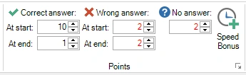{ width="222" loading=lazy }

With these options you can reward players who answer quickly with more points. At the same time, wrong answers can be penalized more at the beginning of a question to prevent people guessing/gambling immediately after the countdown started.

For a multiple-choice question you can set speed bonus points for the top three fastest players to answer the question correctly. This results in an ‘everyone can answer’ question, with a ‘fastest finger’ element. To access the bonus points setting, click the ‘Speed Bonus’ button in the Points section, after which the following form opens:

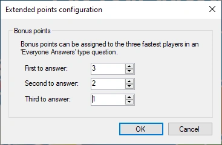{ width="201" loading=lazy }

Assign a value greater than zero for each entry (if you only want to award the fastest player, only fill in points for the first to answer). During the quiz, an animated bonus-points indicator will appear on screen after the question is over to highlight the player(s) who won the bonus points.

The jingle of the number one bonus point winner will also be played (for more information about jingles please refer to [Configuring sounds – the Sounds tab page](../../setup/configuring-sounds-the-sounds-tab-page.md))

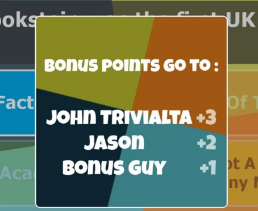{ width="275" loading=lazy }

## Multiple choice questions

When creating a multiple-choice question, you can indicate in QuizXpress Studio which one of the answers is the correct one. If you do this, QuizXpress can judge given answers by teams for correctness when playing a quiz. You can indicate which answer is the correct one by first selecting one of the answers with the mouse and then putting a checkmark before ‘Correct Answer’ in the Properties Pane. You can also use the context menu by first selecting the answer, then right-clicking and choosing ‘Set correct answer’. Next to this, you can set correct answers for multiple-choice questions in the ‘Table Mode’ representation of the questions (click the VIEW tab and then ‘Table Mode’). In the last column of the grid, you can indicate the correct answer for (single-answer) multiple-choice questions.

## Multiple correct answers

QuizXpress supports having multiple correct answers. The following options are available:

### Single correct

This is the default mode, where there is one single correct answer for a multiple-choice question.

### Multiple correct (one response)

In this mode the question can have multiple correct answers, but the players can only choose one of these answers. For each answer you can set a different correctness if applicable. You can use this to create questions where players can gain more points if they are ‘closer’ to the correct answer as illustrated in the below question (2000 is the exact answer):

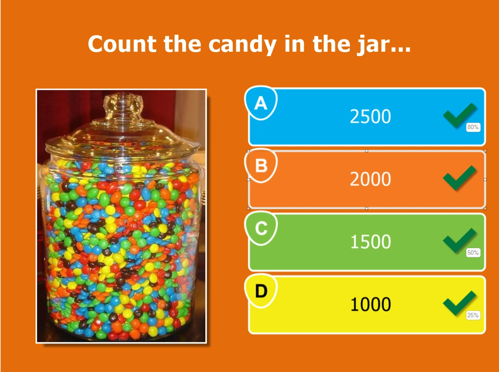{ width="449" loading=lazy }

Setting the ‘correctness’ of an answer can be done by right clicking the answer and selecting ‘Set Correctness’ from the context menu. The following dialog helps you setting the correctness value:

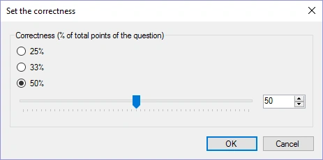{ width="311" loading=lazy }

You can also use this to create ‘Family Feud’ style questions like the below. By giving the answers the correctness of the family feud answer percentages, choosing a more popular answer will award a player with more points. If you set the points for the question to 100, the number of points that can be won by a player for giving a certain answer is the corresponding percentage.

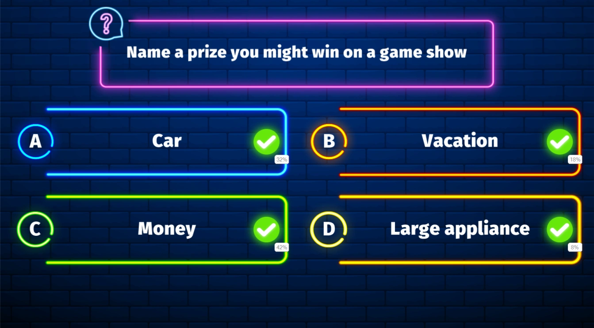{ loading=lazy }

### Multiple correct (multiple responses)

In this mode, the question can also have multiple correct answers, each with a different ‘correctness’, but now the players can select more than one answer. So, for example, when answers A and C are both set to correct (each with 50% correctness), players can earn 100% of the points by responding to the question with *both* A and C. If they responded with A and B instead, they would gain only 50% of the points.

If players should respond with all correct answers in order to win points, select the question and in the properties pane set the ‘response mode’ to ‘multiple responses, exact match’.

### Ordered

In this mode, a player must put the answers in the correct order. You can make questions such as the one shown below (correct response would be C->A->D->B).

If you want the players to give the exact order to win points, select the question and in the properties pane set the ‘ordered answer mode’ to ‘exact match’ (which is the default). If giving a partially correct order should also lead to winning points, set the ‘ordered answer mode’ to ‘partial match’. In this case, the percentage of answers given at the right spot will result in the same percentage of the points that can be won for the question. For example, if the correct order is ABCD and a player answers ACBD, this will result in 50% of the points that can be won for the question.

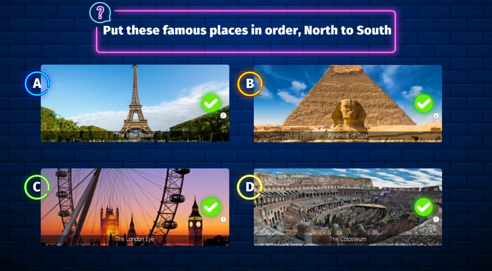{ loading=lazy }

To change the order, right click one of the ordered answers and click ‘Set Order’: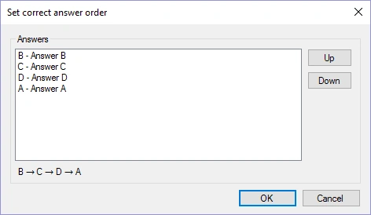{ width="284" loading=lazy }

## Numeric, full-text and first letter questions

QuizXpress supports three input types that can be used with the Smart Buzzer app or buzzerpad website: numeric, full-text, and first-letter. You can use these input types in combination with an open question. The options are as follows:

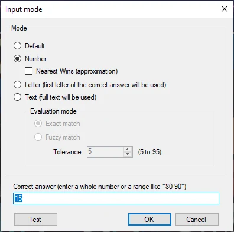{ width="286" loading=lazy }

Choosing *Default* for an open question results in a regular fastest finger question that can be played with buzzers or keypads. When using the Smart Buzzer app or buzzerpad website, a buzzer will be shown on screen. The person who presses first locks out the buzzers of all other players and responds verbally to the quizmaster with the answer.

### Number input

|     |
|-----|

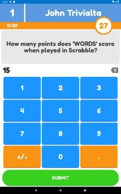{ width="126" loading=lazy }For the *Number* input type, the Smart Buzzer app or buzzerpad website presents a screen to the players where they can enter a numeric value.

For numeric questions, you can also specify a range like ‘80-90’. This means all answers between (inclusive) 80 and 90 are judged as correct. Or you can turn the question into an approximation question (e.g., ‘how many marbles are there in the jar’) where only the player with the answer closest to the correct answer gets points. In this case, put a tick before ‘Nearest wins’. When there are multiple winners, the players who gave the answer quickest win the points.

On numeric nearest-wins type questions, an arbitrary number of players can win points. You configure the number of winners in the properties grid by changing the ‘Nearest Wins’ field.

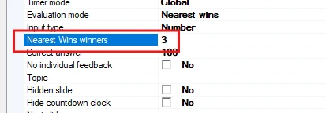{ width="413" loading=lazy }

In this case the top 3 of players nearest to the correct answer win points.

### Full text input

The *Full-Text* type allows players to enter free text (not case-sensitive; capitals do not matter).

For full-text questions, you can indicate if you want an exact match with the given answers, or you can use fuzzy matching and set a tolerance to allow for small spelling errors. If you want to allow multiple answers, you can enter multiple texts in the ‘correct answer’ field separated by a semicolon (for example ‘Belgium;Belgique;Belgie’). Use the Test option to validate that the tolerance for ‘fuzzy match’ text answers is working correctly.

#### Multi-response full text questions

Text questions can also have multiple responses. For example, you can play a song and ask for the artist and the title. Each correct answer will yield 50% of the points. Let’s say you’re playing a Madonna song named Holiday and you want the players to answer both the artist and the title:

1)  Create a standard text question with the correct answer: Madonna 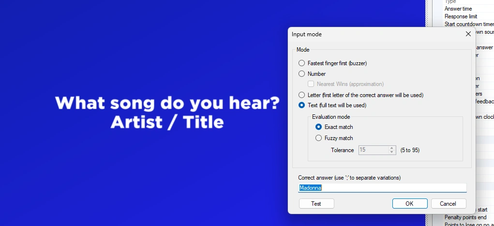{ width="602" loading=lazy }

2)  Go to the slide’s advanced properties and look for ‘Full-text answers’.

3)  Click the three dots \[…\] to open the Full-text answer editor and add the song title ‘Holiday’. If needed, you can also set fuzzy matching per answer or enter answer variations per correct answer separated by a semicolon:

When the question is presented the player sees the following screen:

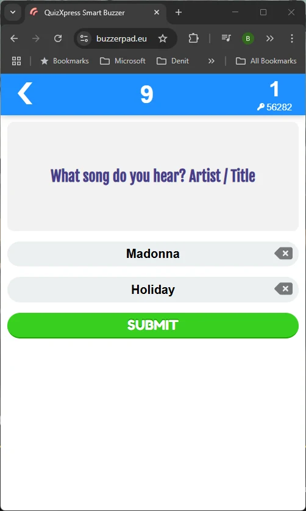{ width="335" loading=lazy }

By default, the player sees as many input fields as there are correct answers defined, but you can also limit the number of inputs with the ‘Full-text response limit’ setting:

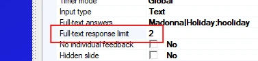{ width="377" loading=lazy }

So, for example, you could ask ‘Name 4 countries that border Germany’, set the Full-text response limit to 4, and enter all 9 bordering countries as the correct answers.

### Letter input

For the *Letter* type, an A-Z grid is presented for players to pick one letter from.

Questions with response type letter show a grid on the phone with all letters of the alphabet. Players choose the first letter of what they think is the answer. At the end of the question the buzzer shows whether the answer was correct or incorrect, along with the full correct answer.

For first-letter questions you can also show the letter grid on the mobile buzzer shuffled (once or every 2 seconds) as an extra challenge for the players. The setting is available in the slide’s advanced properties panel:

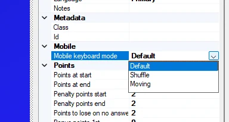{ width="231" loading=lazy }

When this option is set to *Shuffle* or *Moving*, the grid on the buzzer has a random layout:

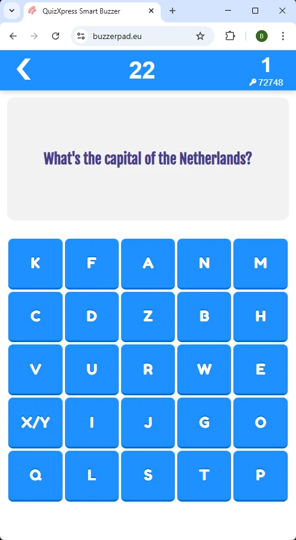{ width="187" loading=lazy }

## Pairing questions
