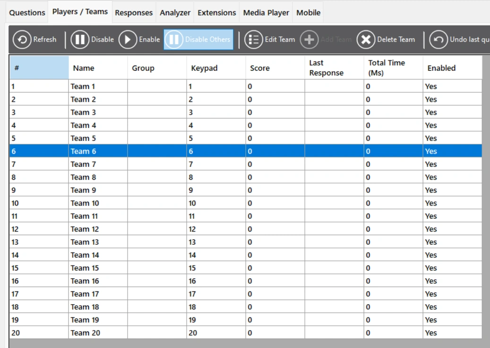
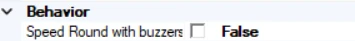

# Speed Round

In a Speed Round, one player needs to answer as many questions as possible within a configurable amount of time. This player must be manually selected in QuizXpress Director by the host.

*To do this, go to QuizXpress Director. Select the team that needs to play the speed round and press ‘Disable Others’. (Remember to enable the other players, or change the only active player, depending on what you want to do, after the Speed Round has ended.)*

{ width="371" loading=lazy }

After finishing a question, a new one is presented, but the same clock keeps ticking. To add a speed round to your quiz, set the first slide of your Speed Round to the slide type ‘Speed Round’. The round must end with an ‘End of Round’ slide. Note that the slides between the beginning and end of the round must NOT be set to the type Speed Round. There are two ways to play a speed round: manually or with buzzers. When the Speed Round is set to play manually, the host judges the answers manually (the host presses Y for correct, or N for incorrect). When the Speed Round is set to play with buzzers, players can use their buzzers/keypads/phones to answer the questions.

*The setting for manual/buzzers in the properties panel. False means playing manually, True means playing with buzzers.*

{ width="284" loading=lazy }
