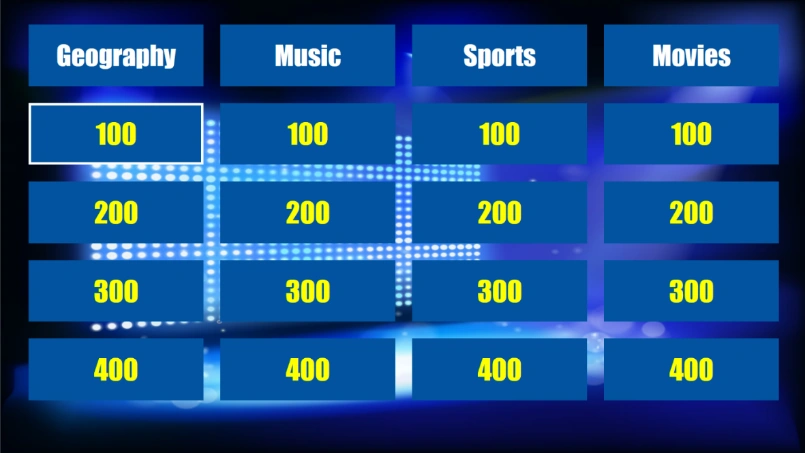
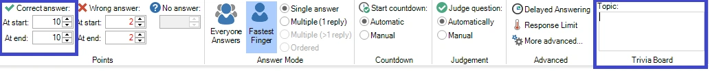
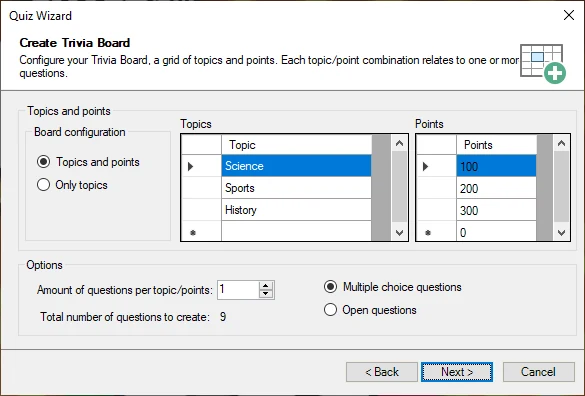
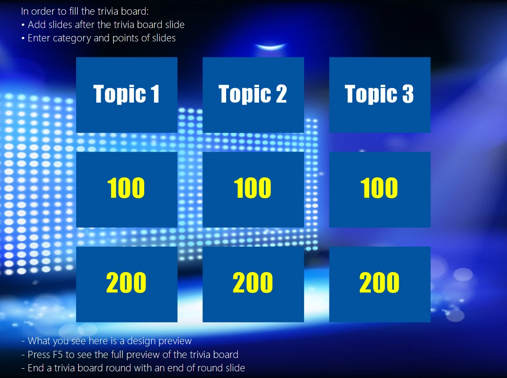

# Trivia Board round

A Trivia Board round enables you to create a Jeopardy®-style question board with topics and questions of varying difficulty/points.

{ width="513" loading=lazy }

Just like regular quiz slides, a trivia board can be fully styled (please refer to section [Trivia Board properties](../user-interface-overview/advanced-properties-grid.md#trivia-board-properties) for more details on the options).

During the quiz show, the questions on the board can be chosen (by keyboard, using the mouse or quizmaster remote) or randomly picked in which case a random selector jumps over the screen and chooses one of the tiles.

## How to create a Trivia Board?

To create a trivia board, start by inserting a trivia board slide into the quiz (go to the INSERT menu, click on the dropdown list in the Quiz Slides section and choose the Trivia Board layout). The trivia board will be generated automatically by the questions that follow it.

To categorize the questions into topics and points (or topics only), make sure to set the following properties of the questions following the trivia board:

- The topic

- The points

You can enter both on the QUESTION tab while the question is selected:

{ width="604" loading=lazy }

Alternatively, you can also enter the properties on the properties pane (if this is not visible, please show it first by selecting the VIEW tab and setting a checkmark before ‘Properties’).

A Trivia Board can be mixed with other QuizXpress game formats. To create a Trivia Board (round), QuizXpress needs to know where a Trivia Board round ends. A Trivia Board round ends at one of the following slide types:

- an ‘End of round’ slide (please also check 3.4.3)

- another Trivia Board slide

- a Trivia Ladder slide

- the end of the quiz (last round or a Trivia Board only game)

During the quiz show, all slides from a Trivia Board round are processed and grouped per topic. Within a topic, questions are grouped by the number of points. In this way, behind every points tile on the board there can be multiple questions. Once the questions behind a certain tile on the board are exhausted, the tile is greyed out and can no longer be chosen.

Questions that have no points (for example, Audience response, Demographic, Wager) are ignored when creating the Trivia Board.

Alternatively, the Quiz Wizard can help you create a complete Trivia Board round with a few clicks! Start the wizard (HOME tab followed by ‘Quiz Wizard’) and select ‘create a new round’ followed by ‘a Trivia Board round’. Now, fill in the topics, points, and other preferences.

{ width="499" loading=lazy }

Choose the question time, points, and style used on the next pages, and press ‘Finish’ to create the board, questions, and closing end-of-round slide for you. Of course, you will still need to fill in the actual questions, but the correct topic and points will already be set for you.

## Preview a Trivia Board

The Trivia Board in QuizXpress Studio as shown on the Trivia Board slide is only used for design purposes. By setting the styling options of the Trivia Board as well as the background you can determine the looks of the board.

{ width="504" loading=lazy }

When you want to have a preview of the board like it will be shown during the game show, press F5 and the board will be automatically generated from the questions present in the Trivia Board round.
