# Trivia Feud

Set the slide type to ‘Trivia Feud’ to create a survey-based game. After setting the slide type to Trivia Feud, the Survey editor pops up where you can enter the survey question and the survey answers with the corresponding percentages:

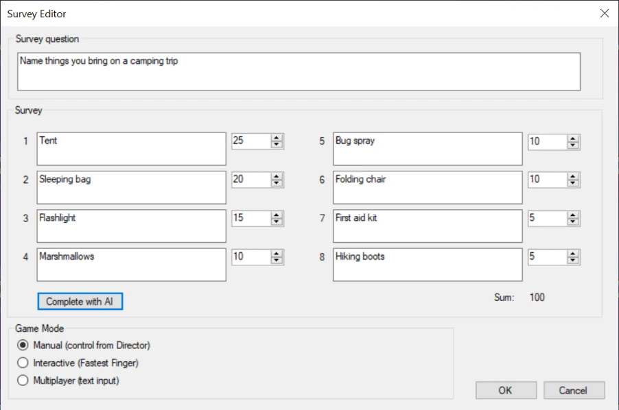{ width="578" loading=lazy }

Next to entering the survey details and responses, you can set the game to three different modes: Manual, Interactive or Multiplayer. You can read more about this below.

You can use the QuizXpress artificial intelligence functionality to help you generate surveys. After entering a survey question, press the ‘Complete with AI’ button to automatically fill in the survey answers and the corresponding percentages. Please refer to [Mini games](../mini-games/index.md) for more information.

After entering the details and pressing OK, the preview in QuizXpress Studio looks as follows. The background of the screen can be changed (to include for example your company name or branding).

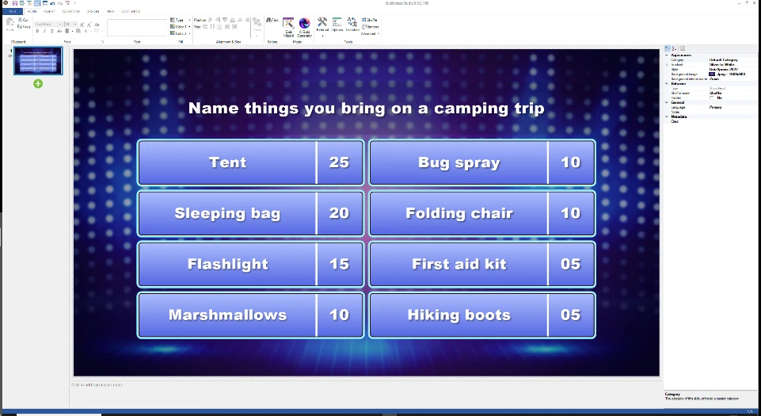{ width="615" loading=lazy }

When clicking the survey, the TRIVIA FEUD tab is shown in the ribbon. The game mode can be changed here, and the Survey Editor can be opened by clicking ‘Edit Survey’.

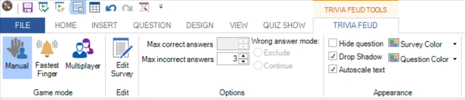{ width="592" loading=lazy }

There are various options available in the toolbar and in the advanced properties window, which will be explained later in the context of the different modes available.

After starting the quiz show, QuizXpress Live shows the Trivia Feud board with the survey question and the hidden survey answers. The below board is an example of a Feud game in Manual mode.

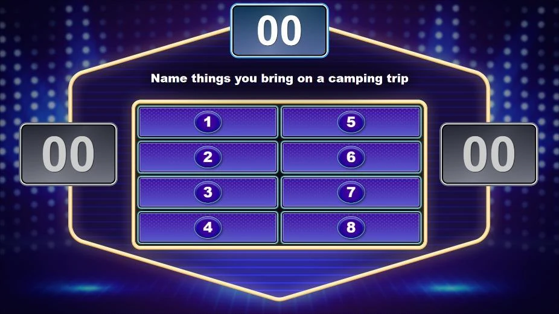{ width="591" loading=lazy }

Trivia Feud has three game modes: **Manual**, **Interactive** (fastest finger), and **Multiplayer**.

## Manual mode

In manual mode, the game is fully controlled from a screen in QuizXpress Director, the quizmaster control panel, which runs on the laptop screen while the game show runs on a big screen.

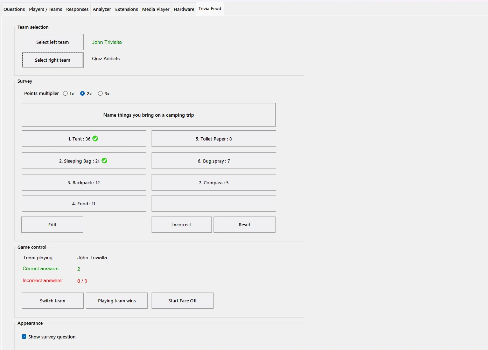{ width="474" loading=lazy }

Survey answers given by the players can be manually revealed by pressing the corresponding buttons in Director. Accumulated points are shown on top, and the scores are shown for both teams.

You can also use it to play the exact game show format as known from TV by taking the following steps:

- Start with a Faceoff between the two teams by pressing the ‘Start Faceoff’ button:

- Players use their buzzer (which can be a keypad, buzzer or mobile phone) to buzz in. The fastest player to buzz in is shown onscreen.

- The player that was first to buzz gives an answer on the survey.

- The quizmaster reveals the answer (if it’s on the board) by pressing the corresponding button in QuizXpress Director. The points of the answer are added to the points of the top scoreboard, which shows the points that can be won by the winning player.

- Press the ‘Switch team’ button.

- The other player now also gives an answer to the survey which the quizmaster reveals on the board if present.

- Depending on which team gave the highest rank answer, make this team the ‘playing team’ (so keep the currently selected team or press ‘switch team’ again).

- The members of the playing team (or the individual, in case it’s a head-to-head game between two persons) try to mention as many answers as possible.

  - If an answer is present, click the corresponding answer to reveal it on the board and accumulate the points to the total points to be won, which is shown on top of the board.

> 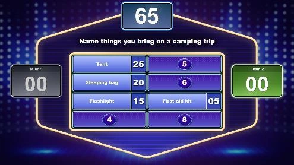{ width="317" loading=lazy }

- If an answer isn’t present, click the ‘Incorrect’ button to show a cross on screen indicating the answer was incorrect. The ‘max wrong answers’ setting of the board, which was indicated in QuizXpress Studio for the slide, determines after how many crosses the turn goes to the opposing team:

> 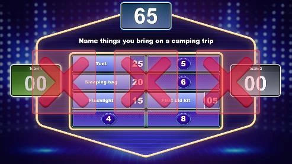{ width="316" loading=lazy }

- As in the official TV show, the opposing team now gets a chance to guess one of the remaining answers. The answer given is either:

  - visible on the board - click the corresponding answer in Director to reveal it. Then click the ‘Playing team wins’ button to assign the points to the team:

> 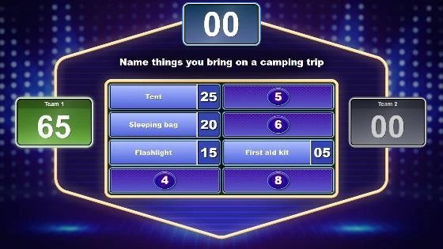{ width="358" loading=lazy }

- not present on the board - click the ‘Incorrect’ button to show the red cross. Now click ‘switch team’ to switch back to the team that originally played and then click the ‘Playing team wins’ button to assign the points to the team.

- Finally, you can manually reveal the remaining answers for the players and the viewing audience.

The above outline shows you how to play the game in the same way as the original TV show format. As the manual setting gives you full control, you can also think of alternative ways to play the game.

If you have another means of determining which team will start the game, you can also manually select a team by pressing the ‘team playing’ message:

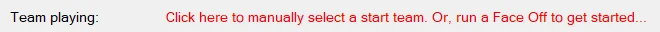{ width="596" loading=lazy }

This will show a selection window where you can select the starting team.

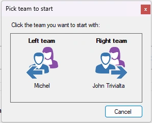{ width="170" loading=lazy }

If you have more than 2 players/teams playing, you can select which teams will play each other by clicking the ‘select left team’ and ‘select right team’ buttons.

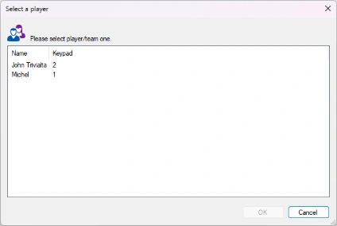{ width="271" loading=lazy }

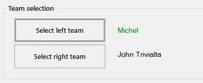{ width="317" loading=lazy }

The control panel in QuizXpress Director also contains a ‘points multiplier’. Choosing a value of 2 or 3 rewards players with 2 or 3 times as many points, respectively. You could apply this for a final round, for example, where a team has to pass a certain number of points in order to win.

## Interactive (Fastest Finger) mode

In this mode, all players play along and can buzz in to give their answer.

The fastest player buzzing in is shown on the big screen with the current number of points and gets a chance to answer the survey.

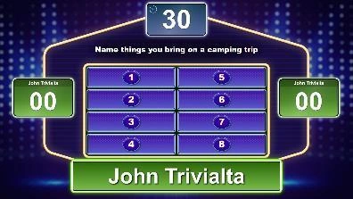{ width="255" loading=lazy }

Players have a limited time to provide an answer. This is indicated by a countdown timer at the top. The time can be configured in the Answer Time property (available in the property grid). If a player fails to answer within the timeframe, three crosses appear and the player gets penalty points deducted.

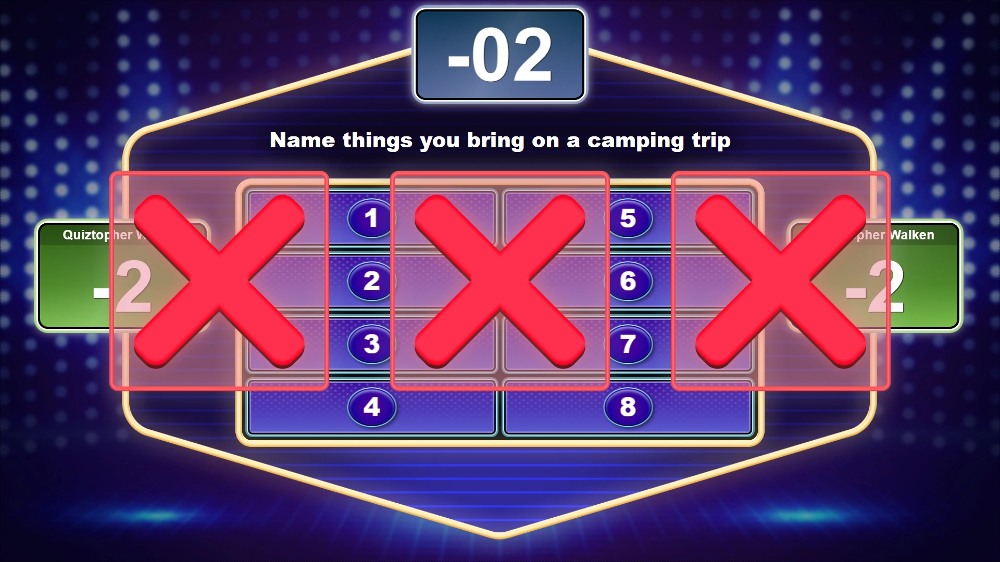{ width="605" loading=lazy }

If the answer given is on the board, the quizmaster reveals the answer by clicking the corresponding button in QuizXpress Director. Points are shown on top and then added to the player’s total.

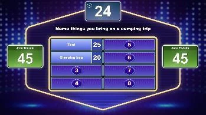{ width="223" loading=lazy } 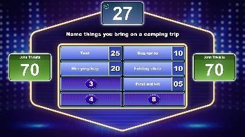{ width="227" loading=lazy }

If the answer given isn’t present, click the cross in Director, which is then shown on the big screen. Points that are indicated for ‘wrong answer’ on the QUESTION tab will be subtracted in this case.

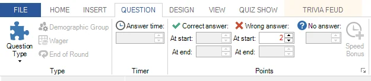{ width="568" loading=lazy }

When creating the Trivia Feud slide in Fastest Finger mode, you can indicate how many answers a player can give after buzzing in (max correct answers), how many incorrect answers can be given before the player’s turn is over (max incorrect answers), and whether a player is excluded from the current board or can buzz in again (Exclude or Continue).

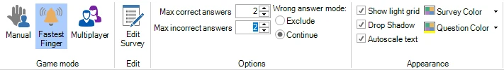{ width="605" loading=lazy }

You can change the above settings too in the Advanced properties pane, which you can show by clicking the VIEW tab and putting a checkmark before ‘Properties’. In this pane, you will see all the settings that apply to the Trivia Feud once you click it.

The auto reveal option indicates whether the remaining answers that were not mentioned will be automatically shown once all players are out of the game, or whether the host will manually reveal them one by one by clicking the answers in QuizXpress Director.

## Multiplayer Mode

When the board is in multiplayer mode, everyone in the audience can play along.

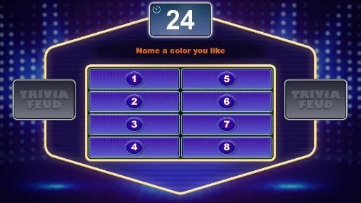{ width="321" loading=lazy }

A countdown timer is displayed at the top of the Trivia Feud board. In QuizXpress Studio, on the QUESTION tab, the ‘Answer time’ can be configured in the same way as for a regular question.

Players submit their answers via their mobile phone while the countdown is running, by entering and submitting multiple texts.

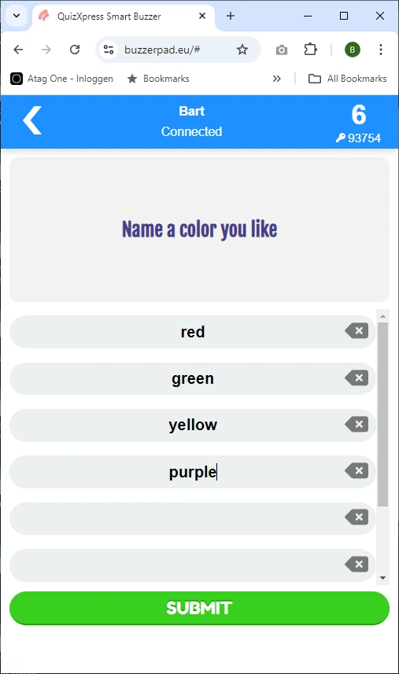{ width="385" loading=lazy }

In the properties window in Studio (if not visible, show it by clicking the VIEW tab and then putting a check before Properties), you will see the following options that apply to multiplayer mode:

**Response limit** – specifies the maximum number of answers a player can submit.

**Tolerance** – specifies the tolerance used by QuizXpress for judging the answers given. Setting the tolerance higher allows more spelling mistakes.

**Auto reveal** – indicates whether, at the end of the countdown, the answers will be automatically shown or the host will manually reveal them one by one by clicking the answers in QuizXpress Director.

In this mode, you can specify multiple correct answers, separated by a semicolon:

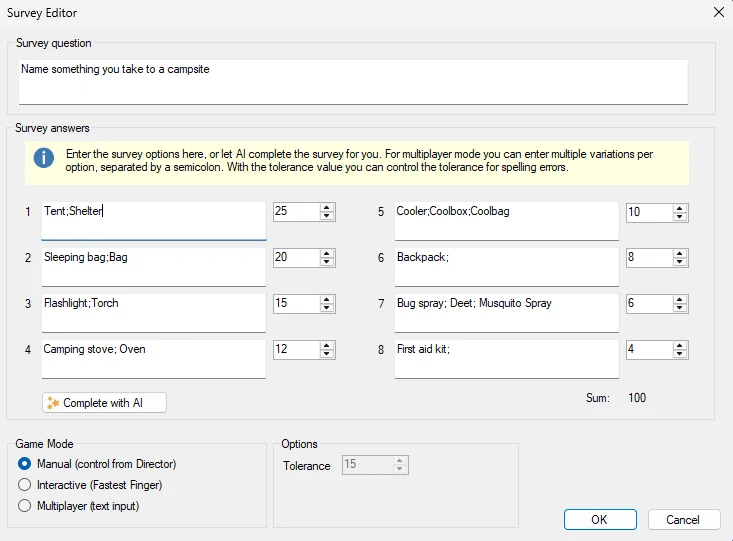{ width="430" loading=lazy }

The input of the players is matched against each entry with the set tolerance.
