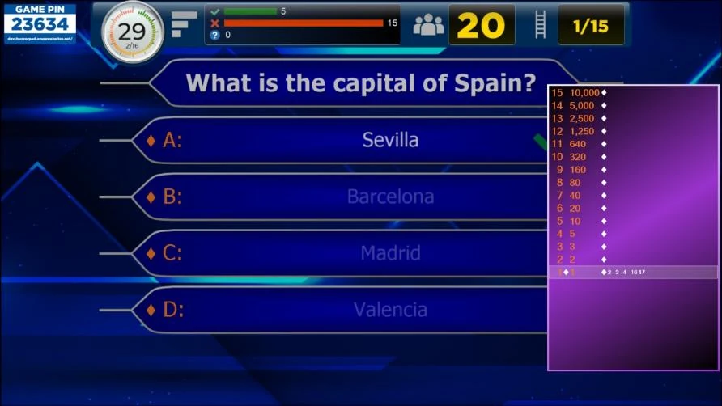
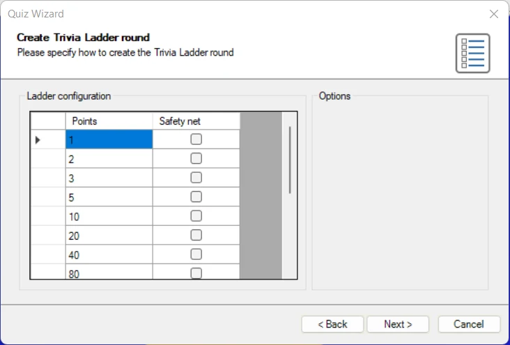
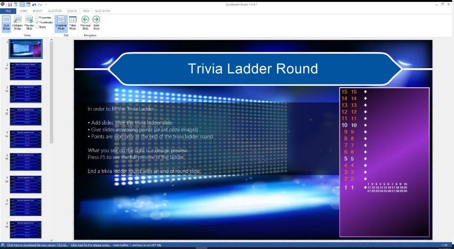

# Trivia Ladder round

A Trivia Ladder round enables you to create a ‘Who Wants to Be a Millionaire®’-style round where (a) player(s) try to move up a ladder by answering questions correctly.

{ width="570" loading=lazy }

Just like regular quiz slides, a Trivia Ladder can be fully styled (please refer to [Trivia Ladder properties](../user-interface-overview/advanced-properties-grid.md#trivia-ladder-properties) for more details on all the options).

## How to create a Trivia Ladder?

To create a Trivia Ladder, start by inserting a Trivia Ladder slide into the quiz (go to the INSERT menu, click on the dropdown list in the Quiz Slides section and choose the Trivia Ladder layout). The Trivia Ladder will be generated automatically by the questions that follow it.

!!! note

    contrary to all other slide types, the Trivia Ladder slide is not shown by itself during the quiz show. Its purpose is only to create the ladder, which will be shown on each slide of the Trivia Ladder round during the quiz.

In order to fill the Ladder, create as many questions as you would like to be steps on the ladder *after* the Trivia Ladder slide. Below you can see one step of the ladder.

{ width="425" loading=lazy }

Ladder Step

The question numbers are shown on the left-hand side of the ladder. The points displayed on the right of the question number are defined by the points that the respective questions in the Trivia Ladder round have. It is also possible to add prizes to the ladder instead of points. On the right-hand side of each step, the keypads that are on that step are displayed.

The leftmost separator (diamond) indicates if the question on the step has been played.

Only at the end, when the last ladder question has been finished, each player (keypad) receives the points of the step that he or she is on.

The safety net steps on the ladder are typically colored differently (white in the picture below for example) to indicate which steps players fall back to when they answer incorrectly (in case the *wrong answer action* of the ladder is set to ‘Fall to safety net’).

Just like the Trivia Board, a Trivia Ladder can be mixed with other QuizXpress game formats. To create a Trivia Ladder (round), QuizXpress needs to know where a Trivia Ladder round ends. A Trivia Ladder round ends at one of the following slide types:

- an ‘End of round’ slide (please also check 3.4.3)

- another Trivia Ladder slide

- a Trivia Board slide

- the end of the quiz (last round or a Trivia Ladder only game)

Questions that have no points (for example, Audience response, Demographic, Wager) are ignored when creating the Trivia Ladder.

Alternatively, the Quiz Wizard can help you create a complete Trivia Ladder round with a few clicks! Start the wizard (HOME tab followed by ‘Quiz Wizard’) and select ‘create a new round’ followed by ‘a Trivia Ladder round’. Now, fill in the points and indicate where the safety nets are.

{ width="544" loading=lazy }

Choose the question time, points, and style used on the next pages, and press ‘Finish’ to create the ladder, questions, and closing end-of-round slide for you. Of course, you will still need to fill in the actual questions, but the points, safety nets, and ladder framework will already be set for you.

## Position on the Trivia Ladder

When a player answers a question correctly in a Trivia Ladder round, he or she advances one step on the ladder. When a question is answered incorrectly, the following can happen based on the ‘Wrong answer action’:

- Same step – player stays on the same step of the ladder.

- One step down – player goes down one step on the ladder.

- Fall to safety net – player falls back to the first safety net encountered.

- Back to bottom – player falls off the ladder and must restart.

## Preview a Trivia Ladder

The Trivia Ladder in QuizXpress Studio as shown on the Trivia Ladder slide is only used for design purposes. By setting the styling options of the Trivia Ladder you can determine the looks of the ladder (please refer to [Trivia Ladder properties](../user-interface-overview/advanced-properties-grid.md#trivia-ladder-properties) for more details on the options).

{ width="596" loading=lazy }

When you want to preview the ladder like it will be shown during the game show, press F5 (or right click on the ladder and press ‘Preview’) and the ladder will be automatically generated from the questions present in the Trivia Ladder round.
