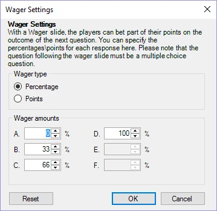

# Wager

With Wager questions, players can bet (a percentage of their) points on the question that will follow the wager slide. When the type of a question is set to ‘Wager’, the window below is shown. During a quiz, players wager with (a percentage of) points based on how much they think they know about a subject. On the slide itself, you can change the text or design to refer to the subject of the question that will follow (for example: ‘The next question is about sports, how many points would you like to wager?’).

| { width="253" loading=lazy } | You can always change these options by pressing the ‘Wager’ button next to the ‘Question Type’ button (or by using the QuizXpress property grid). |
|--------------------------------------------------------------------------------|---------------------------------------------------------------------------------------------------------------------------------------------------|
