# Styles

A quiz slide can be assigned various styles. Here is a selection of the available styles:

| 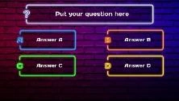{ width="142" loading=lazy } | 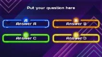{ width="136" loading=lazy } | 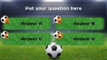{ width="137" loading=lazy } | 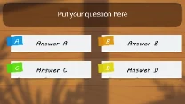{ width="133" loading=lazy }  |
|----------------------------------------------------------------------------------|----------------------------------------------------------------------------------|----------------------------------------------------------------------------------|----------------------------------------------------------------------------------|
| Neon Street                                                                      | Neon Tubes                                                                       | Sports                                                                           | Paper Sheets                                                                     |
| 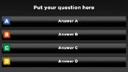{ width="137" loading=lazy } | 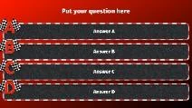{ width="136" loading=lazy } | 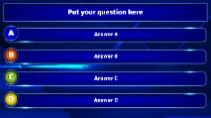{ width="135" loading=lazy } | 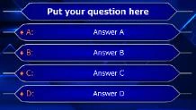{ width="140" loading=lazy } |
| Black-Color                                                                      | Formula 1                                                                        | TV Show                                                                          | Millionaire                                                                      |
| 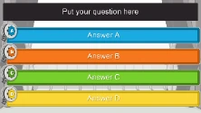{ width="142" loading=lazy }   | 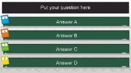{ width="142" loading=lazy }  | 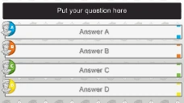{ width="146" loading=lazy }  | 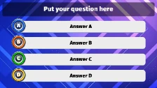{ width="144" loading=lazy }    |
| Film                                                                             | Math                                                                             | History                                                                          | Music Speaker                                                                    |
| 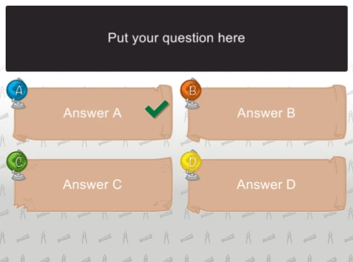{ width="145" loading=lazy }  | 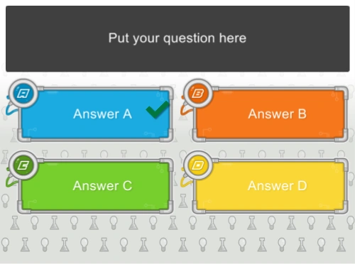{ width="145" loading=lazy }  | 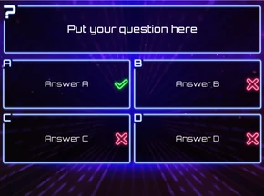{ width="145" loading=lazy }  | *More styles are available in the version you have installed…*                   |
| Geo                                                                              | Tech                                                                             | Techno                                                                           |                                                                                  |

!!! note

    the ‘Just Text’ style can be used to ‘overlay’ text on a custom background picture that you provide — for example, when you want to use a layout designed in PowerPoint.*

You can change the slide style by clicking a style in the style gallery on the DESIGN ribbon tab, or by selecting the style of your choice in the property grid (property name: Style). The change is immediately visible.

You can organize your workspace by filtering out styles (and backgrounds) you don’t use. You access the filter from the ‘dialog launcher’ button in the Style section of the Design ribbon in QuizXpress Studio.

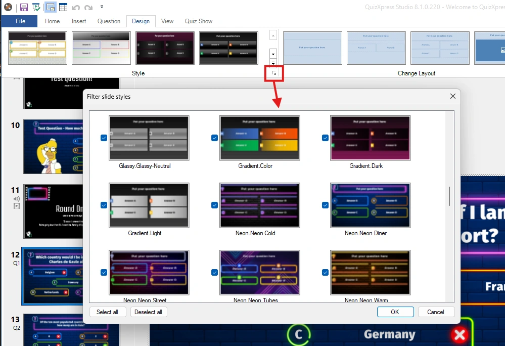{ width="549" loading=lazy }

There are also three slide layouts with a so-called ‘lower third’ layout. These types of layouts can be used, for example, when using QuizXpress as an overlay on a TV camera stream (using a chroma key color).

| 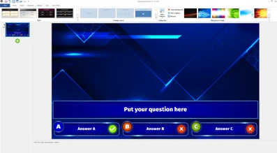{ width="199" loading=lazy } | 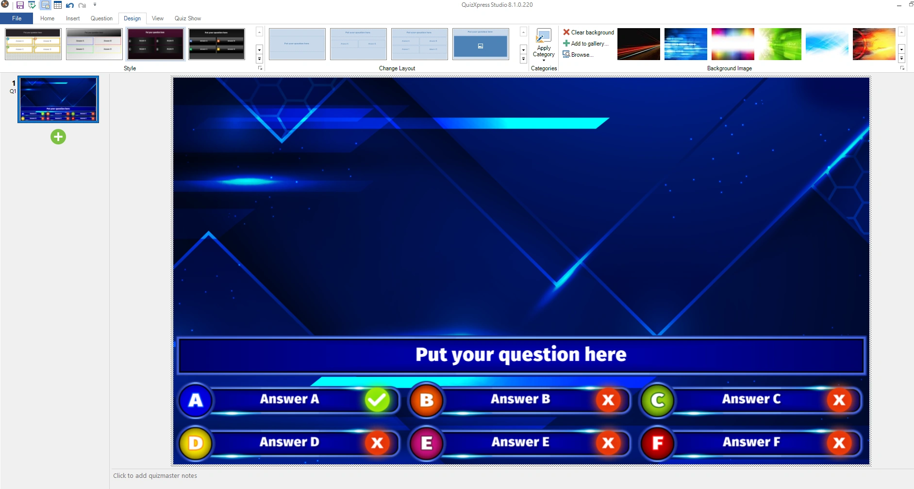{ width="205" loading=lazy } | 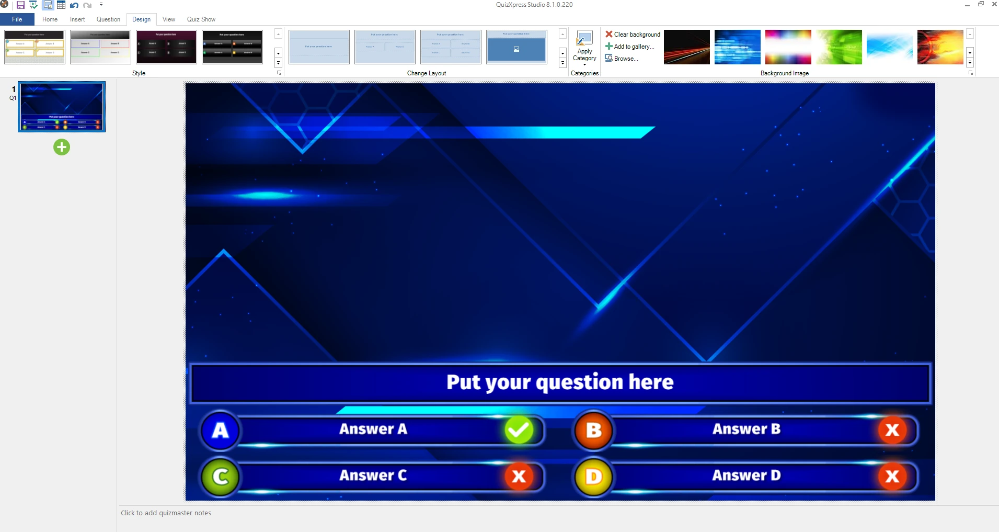{ width="210" loading=lazy } |
|----------------------------------------------------------------------------------------------------------------------------------------------------------------------------------------------------|-----------------------------------------------------------------------------------------------------------------------------------------------------------------------------------------------|----------------------------------------------------------------------------------------------------------------------------------------------------------------------------------------------------|

New, custom styles can be designed in an advanced tool named Style Maker. You’ll find this tool in the Windows Start menu under QuizXpress. The style system is based on what’s known as 9-patch images. In this system, a base image is split into 9 sections (corners and middle parts) and 8 repeatable blocks that ‘glue’ these sections together when the panel is stretched. See the example below:

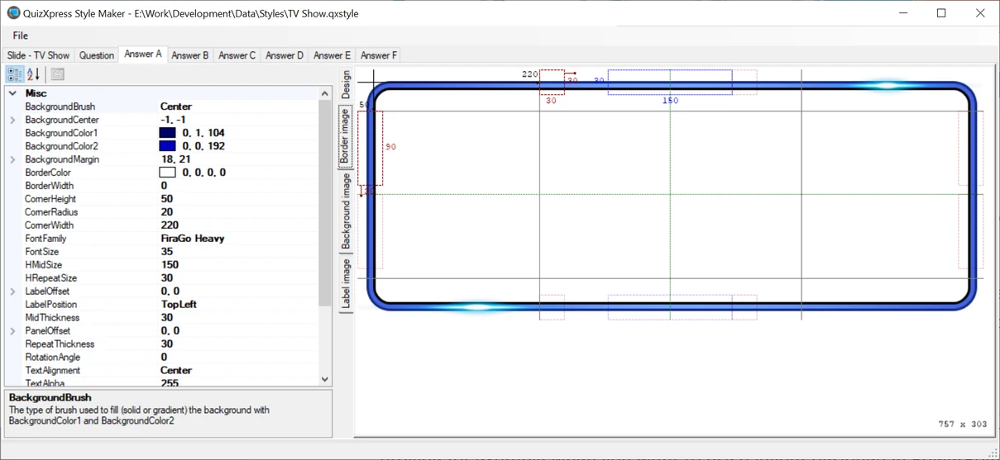{ width="605" loading=lazy }
