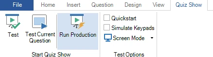

# Testing your quiz

When you’re done designing the quiz content, you can start testing it. To launch the quiz player from within Studio, activate the QUIZ SHOW ribbon tab:

{ width="390" loading=lazy }

As you can see, there are three options here to start the quiz player:

**Test:** run the entire quiz in test mode using the options as set in the section *Test Options*

**Test Current Question:** start the quiz in test mode beginning at the current question.

**Run Production: start the quiz in production mode. In this mode, the Test Options are ignored, and the screen settings, etc. are used as configured globally in Quiz Setup. Always use this mode when running your quiz for a live audience.**

When running in test mode, you can save time by skipping the welcome screen and countdown video with the Quickstart checkbox. And if you don’t want to operate the quiz yourself, you can use Simulate Keypads to run the entire quiz automatically, as if there were an audience and a quizmaster. All you need to do is lean back and check that every quiz slide behaves and looks the way you intended.

!!! note

    never run your production quiz show using any of the test modes. Only in production mode does the quiz player use a special recovery function to restore your quiz to the point it was at when something went wrong, like a computer or program crash.*
