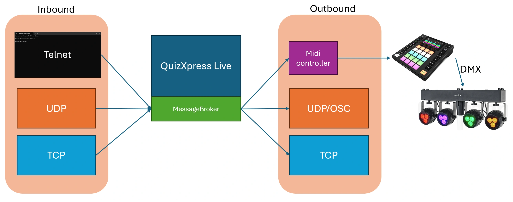
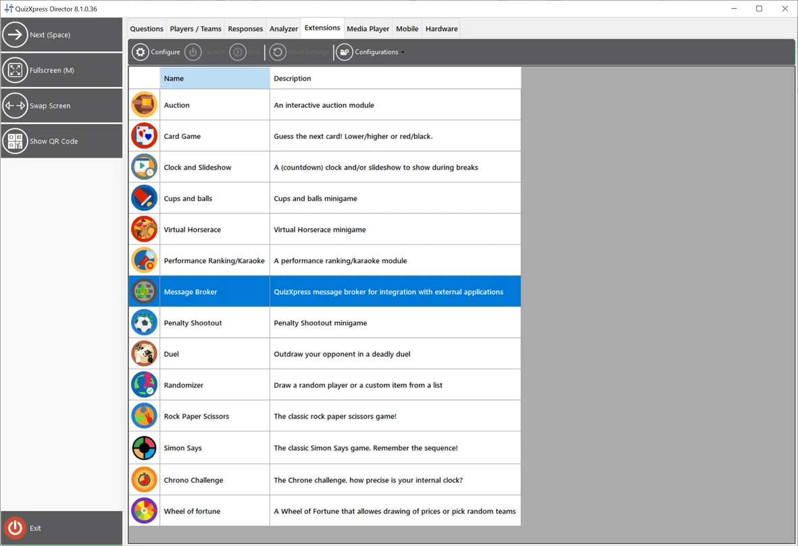

# The Message Broker module

Message Broker is an advanced QuizXpress plugin that enables seamless data exchange with external applications, such as MIDI and DMX light controllers, enhancing the interactivity and professionalism of your game shows. With Message Broker, you can create dynamic, engaging experiences by integrating sophisticated effects that respond to quiz events. (This section was updated for QuizXpress version 8.1 and higher.)

**Available Data Channels in Message Broker:**

- **TCP/UDP protocols:** supports inbound and outbound communication using plain-text messages (ASCII- or UTF8-encoded).

- **Telnet:** Allows sending commands and receiving data directly from a Telnet console.

- **MIDI:** Allows QuizXpress events to trigger mappable MIDI messages, often used to control DMX light tables.

The following picture shows an overview of how things are connected:

{ width="574" loading=lazy }

Message Broker can be utilized to set up quiz rooms, control lighting, create custom game formats, and build external modules using various development environments, such as [Cycling ‘74 Max](https://cycling74.com/). This guide provides detailed instructions on configuring and using Message Broker to maximize its potential.

Note that Message Broker is a licensed add-on for QuizXpress and requires a one-time purchase.

Message Broker is accessible for configuration from the QuizXpress Director screen in a running quiz player:

{ width="591" loading=lazy }

*(To access QuizXpress Director, start a quiz and press the D key, then look for the Extensions tab.)*

For more information [click here to open the detailed Message Broker documentation.](https://quizxpress.com/files/MessageBroker%20MIDI%20and%20DMX%20V8.5.pdf)
