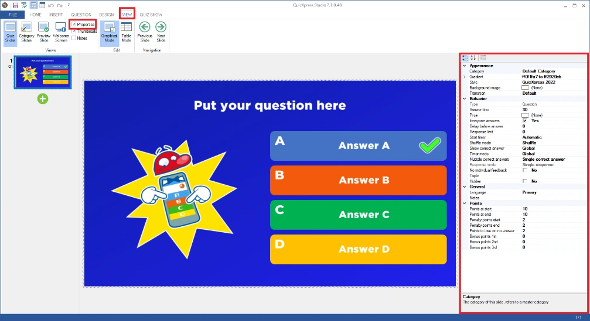

# Advanced properties grid

The property grid is the place where you can quickly set all the detailed properties of the selected element(s). Each element (such as question, answer, slide, video, and picture) has individual properties. It is not absolutely needed to use the property grid as the most important settings can be accessed through the ribbon but for advanced users this may be a quicker way to get things done. (some more advanced/obscure properties can only be accessed from the properties grid). In the following chapters you will find an explanation of the most important properties. You can show the property grid by going to the VIEW menu and putting a checkmark before ‘Properties’ (in the ‘Views’ section).

{ width="644" loading=lazy }

## Quiz slide properties

These properties are shown by clicking on the background of a question. The properties are split in different groups:

- *Appearance*, defining how the question is rendered.

- *Behavior*, defining the behavior of the question during the game show.

- *General*, general properties.

- *Metadata, metadata for this slide (Id and Class)*

- *Points,* points assignment section.

<table>
<colgroup>
<col style="width: 100%" />
</colgroup>
<tbody>
<tr class="odd">
<td><table>
<colgroup>
<col style="width: 19%" />
<col style="width: 80%" />
</colgroup>
<thead>
<tr class="header">
<th>Property</th>
<th>Description</th>
</tr>
</thead>
<tbody>
<tr class="odd">
<td>Answer time</td>
<td>The duration of the countdown in seconds. Specify a value of 0 for a question without time. You can then end the question by pressing the spacebar. Countdown can be paused by pressing ‘P’ in QuizXpress Live.</td>
</tr>
<tr class="even">
<td>Auto judge</td>
<td>This setting is valid for a question that is fastest finger (Voting = no) and that is multiple choice. In this case, the ‘Auto judge’ setting indicates whether a question will be automatically judged by QuizXpress Live when a multiple-choice button is pressed on a buzzer/keypad (for non-multiple choice buzzers auto-judge is always automatically set to ‘No’).</td>
</tr>
<tr class="odd">
<td>Auto advance when media ends</td>
<td>Advance to the next slide automatically when a video or sound on a billboard ends. This helps creating self-running quizzes. This property is available when there is a media element on the slide and when the slide Type is billboard.</td>
</tr>
<tr class="even">
<td>Background image</td>
<td>The background picture of the quiz slide.</td>
</tr>
<tr class="odd">
<td>Background stretch mode</td>
<td>Indicates how the background picture is stretched on the slide. This can either be ‘Fill’ to simply fill the entire slide with the picture (aspect ratio is not maintained) or ‘Zoom’ to keep the correct aspect ratio and possibly loose some parts of the picture</td>
</tr>
<tr class="even">
<td>Bonus points</td>
<td>The bonus points for the 1, 2nd and 3rd fastest player to answer correctly.</td>
</tr>
<tr class="odd">
<td>Class</td>
<td>A user definable text to classify the type of slide. This data will be exported in the Analyzer score file and will be send to MessageBroker so it can be used to trigger a particular behavior</td>
</tr>
<tr class="even">
<td>Category</td>
<td>The category for this quiz slide. By selecting a category, you define the graphical formatting. Note: you can define your own categories! For an explanation of categories please refer to section 3.3</td>
</tr>
<tr class="odd">
<td>Continue after correct answer</td>
<td>When a correct answer is given for a fastest finger question (of type ‘default’, the answer is given verbally and judged as correct) countdown continues and other players can press (often used for games during an event happening outside of a quiz).</td>
</tr>
<tr class="even">
<td>Correct answer</td>
<td>The correct answer for this slide. Applicable only when the input mode (see below) is ‘numeric’, ‘letter’ or ‘text’.</td>
</tr>
<tr class="odd">
<td>Custom HTML Screen</td>
<td>A custom HTML page to be shown on mobile devices when this slide is loaded <em>(advanced usage)</em></td>
</tr>
<tr class="even">
<td>Delay before answer</td>
<td>Time in seconds that will lapse before the answers are shown. This gives a quizmaster the possibility to read the question aloud before answers are shown.</td>
</tr>
<tr class="odd">
<td>Delay between answers*</td>
<td>In case both ‘Delay before answer’ and ‘hide and show one by one’ have been set, this property appears. It defines a timeframe that will lapse between each answer that will appear.</td>
</tr>
<tr class="even">
<td>Demographic group*</td>
<td>This property can be set when the <strong>Type</strong> of the slide is set to ‘Demographic’. It defines a demographic group. When the quiz is run, people pressing their buzzer when a demographic quiz slide is shown will belong to the group indicated by this property. Please also refer to section 5.4.5.5 for more information about demographic groups.</td>
</tr>
<tr class="odd">
<td>End of round action*</td>
<td>This property can be set when the <strong>Type</strong> of the slide is set to ‘End of round’. It’s possible values are ‘Disable one loser’, in which case the participant with the least amount of points is dismissed, and ‘Quizmaster selects losers’, in which case the quizmaster can select the participants that will be dismissed, one by one.</td>
</tr>
<tr class="even">
<td>Evaluation mode</td>
<td>Indicates whether the evaluation of a numeric answer is ‘exact match’ (answer given needs to match the correct answer of the question exactly’ or ‘nearest wins’ (the player who is closest to the answer wins the indicated points).</td>
</tr>
<tr class="odd">
<td>Gradient</td>
<td>The gradient fill for the background of the slide. This property only applies if you have no image in the background. A gradient ‘from’ color and a gradient ‘to’ color can be selected as well as a gradient type.</td>
</tr>
<tr class="even">
<td>Id</td>
<td>A unique ID to identify this slide (for example for static slide routing with the <em>Next slide</em> property)</td>
</tr>
<tr class="odd">
<td>Input type</td>
<td>For an open question you can choose between ‘default’ (fastest finger question) or for a ‘number’, ‘letter’ or ‘text’ answer. The latter three modes apply only when using mobile phones (as keypads and buzzers do not offer numeric or textual input).</td>
</tr>
<tr class="even">
<td>Language</td>
<td>The current (editing) display language of the slide for bilingual quizzes.</td>
</tr>
<tr class="odd">
<td>Lock-out on wrong answer</td>
<td>Sets the lockout mode for a fastest finger question. Either the player is locked out on a wrong answer, or the player can retry.</td>
</tr>
<tr class="even">
<td>Multiple correct answers</td>
<td>Indicates if this question has more than one correct answer and if multiple correct answers are in a specific order</td>
</tr>
<tr class="odd">
<td>Mute countdown sound</td>
<td>Mute the countdown sound for this question</td>
</tr>
<tr class="even">
<td>Next slide</td>
<td>The ID of the slide to show after this slide (static slide routing)</td>
</tr>
<tr class="odd">
<td>Notes</td>
<td>A text (hints) for the quizmaster that will be included in the PDF export</td>
</tr>
<tr class="even">
<td>Ordered answer mode</td>
<td>For ordered answers, you can indicate if you want responses to exactly match the order (Exact match) or if a partial correct response also results in points (a percentage of the points, depending on how many of the answers are at the right spot).</td>
</tr>
<tr class="odd">
<td>Penalty points end</td>
<td>Number of points that are subtracted when a participant answers incorrectly at the end of the countdown (interpolates between start – end)</td>
</tr>
<tr class="even">
<td>Penalty points start</td>
<td>Number of points that are subtracted when a participant answers incorrectly at the start of the countdown</td>
</tr>
<tr class="odd">
<td>Points at end</td>
<td>Number of points that are added when a participant answers correctly at the end of the countdown. Must be smaller than or equal to ‘points at start time’. Points are interpolated between the counter’s start and end. So when points at end time are smaller than points at start time, the number of points to gain decreases while the countdown is running. When the two values are equal, the points that can be gained stay the same throughout the countdown.</td>
</tr>
<tr class="even">
<td>Points at start</td>
<td>Number of points that are added when a participant answers correctly at the start of countdown.</td>
</tr>
<tr class="odd">
<td>Points to lose on no answer</td>
<td>The points that are subtracted when no answer is given (only applicable for voting questions)</td>
</tr>
<tr class="even">
<td>Steal Points</td>
<td>When the steal points option is active for a fastest finger (buzzer) question, a player giving an incorrect answer does not lose points. Instead, the penalty points as configured for the slide are awarded to all the other players and the question immediately ends.</td>
</tr>
<tr class="odd">
<td>Response limit</td>
<td>The maximum number of teams for which the system will take responses. For example, if you play with 100 teams, you can set this value to 25 so only the first 25 teams get to answer the question.</td>
</tr>
<tr class="even">
<td>Response mode</td>
<td>Indicates if this question accepts only one answer per player or multiple (used in combination with ‘Multiple correct answers’). When setting this option to ‘multiple responses, exact match’, the multiple-answer response needs to exactly match the correct answers in order to win points.</td>
</tr>
<tr class="odd">
<td>Revise answer</td>
<td>Here you can override the global option to allow players to revise their answer (globally set in Quiz Setup for all slides).</td>
</tr>
<tr class="even">
<td>Safety net*</td>
<td>Used for trivia ladder questions. When in a trivia ladder round and a player answers incorrectly, he or she falls back to the nearest safety net on the trivia ladder.</td>
</tr>
<tr class="odd">
<td>Script</td>
<td>Custom slide behavior coded in JavaScript <em>(advanced usage)</em></td>
</tr>
<tr class="even">
<td>Show answers action*</td>
<td>When ‘Delay before answer’ has been set, this property appears. By setting it to ‘hide and show at once’, the answers are shown in one go after the delay time has lapsed. By setting it to ‘hide and show one by one’, the answers are shown one by one after the delay time has lapsed.</td>
</tr>
<tr class="odd">
<td>Show correct answer</td>
<td>Mode for showing the correct answer on this slide. Either follow the global setting as indicated in Quiz Setup, never show the correct answer, or always show the correct answer.</td>
</tr>
<tr class="even">
<td>Shuffle mode</td>
<td>Determines what happens when the quiz is shuffled</td>
</tr>
<tr class="odd">
<td>Start timer</td>
<td>Indicates whether the countdown timer should start automatically when the question appears or by a manual action.</td>
</tr>
<tr class="even">
<td>Steal points</td>
<td>Applicable for fastest finger questions. When enabled, all other players steal the points from the player buzzing in when the provided answer is wrong.</td>
</tr>
<tr class="odd">
<td>Style</td>
<td>The render style for the question. You can find more about styles in the chapter “Styles”.</td>
</tr>
<tr class="even">
<td>Text evaluation</td>
<td>Indicates whether the evaluation of a text answer is ‘exact match’ (the given answer must match the correct answer exactly) or ‘fuzzy match’ (an algorithm allows a certain percentage of difference between the given answer and the correct answer, so players can make small spelling mistakes).</td>
</tr>
<tr class="odd">
<td>Tolerance</td>
<td>Allowed variation between the correct answer and given answers. Applies to questions with input type ‘text’ with ‘text evaluation’ set to ‘fuzzy match’.</td>
</tr>
<tr class="even">
<td>Topic*</td>
<td>The topic of the question. This is used to automatically generate a preceding Trivia Board.</td>
</tr>
<tr class="odd">
<td>Transition</td>
<td>The specific transition animation when moving to the next slide (by default, a random transition is selected by the system)</td>
</tr>
<tr class="even">
<td>Type</td>
<td>
Display only field showing the type of the slide:

<ul>
<li>
<em>Question</em>: slide is a normal quiz question.
</li>
<li>
<em>Billboard</em>: slide is display only.
</li>
<li>
<em>End of round</em>: slide indicates the end of a quiz round. Intermediate scores are shown, and the quizmaster has the option to dismiss teams. Also see the property: ‘End of Round’.
</li>
<li>
<em>Test question</em>: slide used to demonstrate the system to the participants. No points are added/subtracted.
</li>
<li>
<em>Demographic</em>: this slide serves to partition all participants into competing groups. Also see property ‘Demographic group’.
</li>
<li>
<em>Last Man Standing</em>: slide is a quiz question. Participants answering the question incorrectly are dismissed from the quiz.
</li>
<li>
<em>Audience Response</em>: slide to simply collect a response from the audience without changing any quiz scores. The response data can be displayed in a chart.
</li>
<li>
<em>Wager</em>: allows the audience to bet a percentage of their scores on the following question.
</li>
<li>
<em>Majority Rules</em>: a slide where the correct answer depends on what is chosen most by the audience
</li>
<li>
<em>Minigame</em>: a slide that launches the selected minigame
</li>
<li>
<em>Trivia Board</em>: a slide that starts a round where questions are organized per Topic/Points and presented as a grid
</li>
<li>
<em>Trivia Ladder:</em> starts a Trivia Ladder round where players move up the ladder for each correct question
</li>
<li>
<em>Speed Round:</em> starts a round where a player must answer as many questions as possible in a fixed amount of time.
</li>
<li>
<em>Trivia Bingo:</em> starts a Bingo round, either built from subsequent quiz slides or as a traditional number-Bingo game.
</li>
<li>
<em>Trivia Feud:</em> a slide where players answer a survey-type question.
</li>
</ul></td>
</tr>
<tr class="odd">
<td>Voting</td>
<td>Indicates whether all participants can answer or if only the participant which is first to buzz can answer.</td>
</tr>
</tbody>
</table>

* visibility of the property depends on other properties
</td>
</tr>
</tbody>
</table>

## Question properties

These properties are shown when clicking on the question box on a slide

| Property                | Description                                                                                          |
|-------------------------|------------------------------------------------------------------------------------------------------|
| Alignment               | The text alignment of the question text                                                              |
| Drop shadow             | Indicates whether a shadow is imposed under the question text                                        |
| Gradient                | The gradient fill for the background of the question.                                                |
| Shadow color            | Indicates the color of the shadow                                                                    |
| Text                    | The text of the question                                                                             |
| Text Color              | The color of the question text                                                                       |
| Text font               | The font used for the question text                                                                  |
| Text reveal animation   | How is the text revealed. Show (default: shows directly), Show letter by letter or Show word by word |
| Text reveal delay (sec) | The delay after which the text is shown                                                              |
| Text reveal speed       | Speed of the text reveal                                                                             |
| Transparency            | Transparency of the background of the question                                                       |

## Answer properties

These properties are shown when clicking on an answer box on a slide

| Property                | Description |                                                                                                                                                       |
|-------------------------|-------------|-------------------------------------------------------------------------------------------------------------------------------------------------------|
| Alignment               |             | The text alignment of the answer text                                                                                                                 |
| Correct answer          |             | Indicates whether the selected answer is the correct answer. Set to ‘true’ if the selected answer is the correct answer.                              |
| Correctness             |             | Applicable for questions with multiple correct answers, this value sets the correctness (as a percentage of the total question points) of the answer. |
| Drop shadow             |             | Indicates whether a shadow is imposed under the question text                                                                                         |
| Gradient                |             | The gradient fill for the background of the question. Whether this property is applicable depends on the style used.                                  |
| Shadow color            |             | The color of the drop shadow                                                                                                                          |
| Text                    |             | The text of the answer                                                                                                                                |
| Text reveal animation   |             | How is the text revealed. Show (default: shows directly), Show letter by letter or Show word by word                                                  |
| Text reveal delay (sec) |             | The delay after which the text is shown                                                                                                               |
| Text reveal speed       |             | Speed of the text reveal                                                                                                                              |
| Text color              |             | The color of the answer text                                                                                                                          |
| Text font               |             | The font of the answer text                                                                                                                           |
| Transparency            |             | Transparency of the background of the answer panel                                                                                                    |

## Picture properties

These properties are shown when clicking on a picture box on a slide

| Property            | Description                                                                                                                                                                                                                                                                                                                                                                                                    |
|---------------------|----------------------------------------------------------------------------------------------------------------------------------------------------------------------------------------------------------------------------------------------------------------------------------------------------------------------------------------------------------------------------------------------------------------|
| Border              | Indicates whether a border is drawn around the picture                                                                                                                                                                                                                                                                                                                                                         |
| Border color        | The color of the border, when enabled                                                                                                                                                                                                                                                                                                                                                                          |
| Border thickness    | Thickness in pixels of the border (when enabled)                                                                                                                                                                                                                                                                                                                                                               |
| Corner radius       | Corner radius for the border line to create a rounded border                                                                                                                                                                                                                                                                                                                                                   |
| Correct answer      | Indicates whether the picture contains the correct answer. This can only be set for pictures when the slide contains only pictures and is a multiple-choice slide.                                                                                                                                                                                                                                             |
| Drop shadow         | Indicates whether a shadow is imposed under the picture                                                                                                                                                                                                                                                                                                                                                        |
| Effect              | Sets an effect on the picture. See [Cropping](../adding-multimedia-content/pictures.md#cropping) for a more detailed explanation about effects.                                                                                                                                                                                                                                                                                                              |
| Hidden              | Hide the picture during the quiz                                                                                                                                                                                                                                                                                                                                                                               |
| Hidden on mobile    | Indicates if a picture shown on a quiz slide should be hidden on the mobile phone. One scenario for using this is when you want to show a different picture on the mobile phone than on the big screen for the audience. For example, you might want the mobile picture to have a different aspect ratio. In that case, you don’t want the picture shown on the big screen to also appear on the mobile phone. |
| Image               | A thumbnail of the image. Click the browse (…) button of this property to browse for a picture.                                                                                                                                                                                                                                                                                                                |
| Inflate             | Determines if the picture should fill the entire area by zooming in                                                                                                                                                                                                                                                                                                                                            |
| Label               | A textual description for the picture (used when the picture cannot be shown)                                                                                                                                                                                                                                                                                                                                  |
| Mobile device image | An alternative version of the image to be used on mobile devices                                                                                                                                                                                                                                                                                                                                               |
| Stretch             | Stretch the image in both directions to fill the area (may distort the image)                                                                                                                                                                                                                                                                                                                                  |

## Sound properties

These properties are shown when clicking on a sound item on a slide

| Property                | Description                                                                                                                                                                                                                                                                                             |
|-------------------------|---------------------------------------------------------------------------------------------------------------------------------------------------------------------------------------------------------------------------------------------------------------------------------------------------------|
| Duration                | The duration of the sound. Initially the full duration is shown.                                                                                                                                                                                                                                        |
| Intro pause             | The time to wait before the sound starts. This gives the quizmaster the possibility to first read the question.                                                                                                                                                                                         |
| Keep playing            | By default, the music you put on a slide stops when the countdown timer ends. With this flag, you can let the music play until you move to the next slide.                                                                                                                                              |
| Pitch                   | The pitch at the start of the countdown                                                                                                                                                                                                                                                                 |
| Remove vocals           | Effect to remove vocals (may yield mixed results)                                                                                                                                                                                                                                                       |
| Repeat                  | Indicates whether the sound should repeat itself.                                                                                                                                                                                                                                                       |
| Replay                  | Replays the sound after the correct answer has been revealed in the question.                                                                                                                                                                                                                           |
| Replay delay            | Shown when replay is enabled. Shows the number of seconds after which the repeat begins                                                                                                                                                                                                                 |
| Replay start            | Sets the time where the sound fragment will start playing                                                                                                                                                                                                                                               |
| Replay end              | Sets the time where the sound fragment will stop playing                                                                                                                                                                                                                                                |
| Reverse audio           | Play the sound fragment reversed                                                                                                                                                                                                                                                                        |
| Sound Storage Type      | Indicates if the sound data is stored embedded in the quiz file or on the local disk (linked)                                                                                                                                                                                                           |
| Speed percentage        | The speed of the sound when it starts playing.                                                                                                                                                                                                                                                          |
| Start at                | The position in the sound file from which the sound will be started.                                                                                                                                                                                                                                    |
| Stop at                 | The time to stop the sound                                                                                                                                                                                                                                                                              |
| Target Pitch            | The pitch at the end of the countdown (pitch will interpolate from start to end)                                                                                                                                                                                                                        |
| Target speed percentage | The speed of the sound when it ends playing. Note: by playing with the ‘speed percentage’ and ‘target speed percentage’ it is possible to play sounds ‘from slow to normal’ or ‘from fast to normal’. Setting both percentages to 100% just plays the sound fragment from start to end at normal speed. |
| Volume                  | The volume at which to play the music                                                                                                                                                                                                                                                                   |
| Volume fade             | Fade in/out when starting/stopping the music                                                                                                                                                                                                                                                            |

## Mini game properties

| Property       | Description                                                                                                                                                                                          |
|----------------|------------------------------------------------------------------------------------------------------------------------------------------------------------------------------------------------------|
| Minigame title | By default the mobile buzzer shows the name of the minigame on screen. You can override this and provide your own text. So instead of seeing “Horse race”, you can now show something more exciting. |

## Video properties

These properties are shown when clicking on a video on a slide

| Property                       | Description                                                                                                                                                                                                                                                                                                                                                                                                                                                                                                              |
|--------------------------------|--------------------------------------------------------------------------------------------------------------------------------------------------------------------------------------------------------------------------------------------------------------------------------------------------------------------------------------------------------------------------------------------------------------------------------------------------------------------------------------------------------------------------|
| Aspect Ratio                   | (read-only) aspect ratio                                                                                                                                                                                                                                                                                                                                                                                                                                                                                                 |
| Codec                          | (read-only) video decoder being used                                                                                                                                                                                                                                                                                                                                                                                                                                                                                     |
| Duration                       | (read-only) length of the video                                                                                                                                                                                                                                                                                                                                                                                                                                                                                          |
| Effect                         | Optional effect on the video                                                                                                                                                                                                                                                                                                                                                                                                                                                                                             |
| End                            | Time to end the video                                                                                                                                                                                                                                                                                                                                                                                                                                                                                                    |
| Intro Pause                    | Delay between showing the slide and starting the video                                                                                                                                                                                                                                                                                                                                                                                                                                                                   |
| Linked File                    | Filename of the external video file if linked                                                                                                                                                                                                                                                                                                                                                                                                                                                                            |
| Loop                           | Repeat the video after it stopped                                                                                                                                                                                                                                                                                                                                                                                                                                                                                        |
| Replay                         | Replays the video after the correct answer has been revealed in the question.                                                                                                                                                                                                                                                                                                                                                                                                                                            |
| Replay delay                   | The number of seconds after which the repeat begins                                                                                                                                                                                                                                                                                                                                                                                                                                                                      |
| Replay start                   | Sets the playback time where the video will start                                                                                                                                                                                                                                                                                                                                                                                                                                                                        |
| Replay end                     | Sets the playback time where the video will end                                                                                                                                                                                                                                                                                                                                                                                                                                                                          |
| Silent                         | Suppress the sound in the video                                                                                                                                                                                                                                                                                                                                                                                                                                                                                          |
| Start                          | Time to start the video                                                                                                                                                                                                                                                                                                                                                                                                                                                                                                  |
| Video Height                   | (read-only) height of the video                                                                                                                                                                                                                                                                                                                                                                                                                                                                                          |
| Video storage type             | Indicates whether the video fragment is embedded or linked. Embedding a video fragment into a quiz means the video fragment is incorporated into the quiz file. Linking a video fragment means a reference is made from the quiz file to a video on the file system. In general, linking videos is recommended. *Note: when linking videos, be sure not to remove the video files from your file system. When moving the quiz to a different computer, the videos must be copied into the same folder as the quiz file.* |
| (read-only) width of the video | (read only) width of the video                                                                                                                                                                                                                                                                                                                                                                                                                                                                                           |

## Shape properties

These properties are shown when clicking on a picture shape or text shape on a slide.

| Property                | Description                                                                                                                                                                                                                            |
|-------------------------|----------------------------------------------------------------------------------------------------------------------------------------------------------------------------------------------------------------------------------------|
| Alignment               | The text alignment of the text shape                                                                                                                                                                                                   |
| Background transparency | Applicable for text shapes. Sets the transparency of the color used for the background (the Gradient property).                                                                                                                        |
| Border color            | The border color of a text shape                                                                                                                                                                                                       |
| Border width            | The width of the border of a text shape                                                                                                                                                                                                |
| Corner radius           | The radius of the border of a text shape. Allows you to make rounded corners.                                                                                                                                                          |
| Drop shadow             | Indicates whether to use a drop shadow for a text shape                                                                                                                                                                                |
| Gradient                | The gradient fill for the background of a text shape. A gradient ‘from’ color and a gradient ‘to’ color can be selected as well as a gradient type.                                                                                    |
| Picture                 | Applicable for picture shapes. A thumbnail of the image. Click the browse (…) button to browse for a picture.                                                                                                                          |
| Rotation Angle          | The rotation angle of the picture or text                                                                                                                                                                                              |
| Shadow color            | Shadow color of the drop shadow for a text shape                                                                                                                                                                                       |
| Stretch                 | Applicable for picture shapes. Stretches the picture to cover the full area of the surrounding selection box                                                                                                                           |
| Text                    | The text of the text shape                                                                                                                                                                                                             |
| Text color              | The color of the text of a text shape                                                                                                                                                                                                  |
| Text font               | The font used for the text shape                                                                                                                                                                                                       |
| Transparency            | Set the transparency of the picture or text                                                                                                                                                                                            |
| Visibility              | Indicates whether a shape (being either a picture or text) is always visible, becomes visible when an answer is revealed, is hidden when an answer is revealed, or is timed (appears at a certain point in time during the countdown). |

## Speech properties

These properties are shown when clicking on a speech item on a slide.

| Property | Description                                                        |
|----------|--------------------------------------------------------------------|
| PreRoll  | Indicates the number of seconds to wait before the speech starts   |
| Rate     | The speed at which the text of the speech item is read             |
| Text     | The text to be read                                                |
| Voice    | The voice to use (choose one from the installed voices in Windows) |
| Volume   | The volume of the spoken text                                      |

## Chart properties

These properties are shown when clicking on a chart on a slide

| Property            | Description                                                                                                                                                    |
|---------------------|----------------------------------------------------------------------------------------------------------------------------------------------------------------|
| Alignment           | Alignment of the title of the chart                                                                                                                            |
| Area background     | Set the background color of the chart data area                                                                                                                |
| Axis color          | The color used for the axis                                                                                                                                    |
| Axis label autosize | Automatically set the size of the labels on the axis. If not set, you can explicitly choose a font and size for the labels                                     |
| Axis label color    | The color used for the labels on the axis                                                                                                                      |
| Chart background    | Set the background color of the area outside of the chart data                                                                                                 |
| Chart type          | The type of chart. Choose between Bar, Column, Doughnut, or Pie.                                                                                               |
| Corner radius       | Radius of the corners of the chart element                                                                                                                     |
| Dropshadow offset   | Show a drop shadow for the chart data area                                                                                                                     |
| Grid color          | The color used for the grid in the chart data area                                                                                                             |
| Label color         | Color of the labels shown for each element in the chart                                                                                                        |
| Label display mode  | For the labels, show absolute values, percentages or both                                                                                                      |
| Label font          | Font of the labels                                                                                                                                             |
| Label style         | Indicates where to position the labels                                                                                                                         |
| Mode                | Indicates the type of data that is shown in the chart: response (percentage of each answer given) or right/wrong (percentage of players that were right/wrong) |
| Show 3D             | Show a 3D representation of the chart                                                                                                                          |
| Show legend         | Show a legend for the chart data (percentage of responses for each answer)                                                                                     |
| Title               | Title of the chart                                                                                                                                             |
| Title color         | Color of the title of the chart                                                                                                                                |
| Title font          | Font of the title of the chart                                                                                                                                 |
| Visibility          | Indicates whether the chart is always visible (with live updates during countdown) or only after the question closes                                           |

## Word game properties

These properties are shown when clicking on a word game on a slide

| Property               | Description                                                                                                                                                              |
|------------------------|--------------------------------------------------------------------------------------------------------------------------------------------------------------------------|
| Alignment              | Alignment of the text                                                                                                                                                    |
| Background fill        | The gradient fill for the background of the word game. A gradient ‘from’ color and a gradient ‘to’ color can be selected as well as a gradient type.                     |
| Center index           | For a word wheel game, indicates the letter which appears in the center                                                                                                  |
| Drop shadow            | Indicates whether to use a drop shadow for the letters in the word game                                                                                                  |
| End reveal at          | Percentage of the countdown time when the reveal ends                                                                                                                    |
| Font                   | The font used for the text                                                                                                                                               |
| Interval               | For unscramble and reveal word games, control the time between the steps in the game: linear, slowing down, or slowing down a lot.                                       |
| Layout                 | For reveal or unscramble word games: dynamic letter grid or fixed letter grid with 52 cells.                                                                             |
| Letter background fill | The gradient fill for the background of the letter boxes in the word game. A gradient ‘from’ color and a gradient ‘to’ color can be selected as well as a gradient type. |
| Letter corner radius   | Radius for the corners of the word game                                                                                                                                  |
| Letter spacing         | Space between the letters in the word game                                                                                                                               |
| Manual control         | Indicates if letters are revealed automatically or if they are manually revealed by the quiz master from QuizXpress Director                                             |
| Padding                | Padding around the letters of the grid                                                                                                                                   |
| Reverse                | For a word wheel game, reverse the direction of the letters                                                                                                              |
| Shadow color           | Color of the drop shadow for the letters                                                                                                                                 |
| Spin                   | Spin the letters in the word wheel around for an extra challenge                                                                                                         |
| Start angle            | For a word wheel game, the start angle where the first letter of the word appears                                                                                        |
| Start reveal at        | Percentage of the countdown time when the reveal starts                                                                                                                  |
| Text                   | The text of the word game                                                                                                                                                |
| Text color             | The text color of the text                                                                                                                                               |
| Text transparency      | The text transparency of the text                                                                                                                                        |

## Trivia Board properties

These properties are shown when a trivia board is selected.

| Property                          | Description                                                                                                                                                                                                                    |
|-----------------------------------|--------------------------------------------------------------------------------------------------------------------------------------------------------------------------------------------------------------------------------|
| Auto select                       | Automatically select a random tile when the board is selected with an animation                                                                                                                                                |
| Animation duration (sec)          | Duration in seconds of the random selection animation                                                                                                                                                                          |
| Animation interval (sec)          | Interval between changing the selection during the random selection animation                                                                                                                                                  |
| Background color (Topic Tiles)    | Set the background color of the topic tiles                                                                                                                                                                                    |
| Background color (Question Tiles) | Set the background color of the question tiles                                                                                                                                                                                 |
| Button margin                     | Set the margin between the buttons                                                                                                                                                                                             |
| Circular tiles (Topic tiles)      | Make the tiles circular (default is rectangular)                                                                                                                                                                               |
| Font (Topic Tiles)                | Set the font of the topic tiles                                                                                                                                                                                                |
| Font (Question Tiles)             | Set the font of the question tiles                                                                                                                                                                                             |
| Hide buttons                      | Hide button if no questions are left for the topic or points                                                                                                                                                                   |
| Max. questions to play            | The maximum number of questions to play or 0 for all questions                                                                                                                                                                 |
| Randomize questions               | If multiple questions are linked to a tile, one will be selected at random. However, if the ‘Randomize questions’ option is not enabled, the questions behind the tile will be presented in the order they appear in the quiz. |
| Text color (Question Tiles)       | Set the text color of the question tiles                                                                                                                                                                                       |
| Text color (Topic Tiles)          | Set the text color of the topic tiles                                                                                                                                                                                          |
| Topics only                       | Only show topics on the board                                                                                                                                                                                                  |

## Trivia Ladder properties

These properties are shown when a Trivia Ladder slide is selected.

| Property                | Description                                                                                                                                                                                     |
|-------------------------|-------------------------------------------------------------------------------------------------------------------------------------------------------------------------------------------------|
| Background color        | Set the background color of the trivia ladder                                                                                                                                                   |
| Background image        | Set the background image of the ladder                                                                                                                                                          |
| Background stretch mode | Stretch mode of the background image                                                                                                                                                            |
| Border color            | Set the color of the trivia ladder border                                                                                                                                                       |
| Display mode            | Where to show the ladder on the screen: slide in from the right of the screen, slide into the center of the screen, show full screen, or always show it (on the right-hand side of the screen). |
| Keypads color           | Set the color of the keypads                                                                                                                                                                    |
| Safety net color        | Set the color of the safety net steps                                                                                                                                                           |
| Separator color         | Set the color of the separators                                                                                                                                                                 |
| Show border             | Show the border of the trivia ladder                                                                                                                                                            |
| Step color              | Set the color of the steps                                                                                                                                                                      |
| Wrong answer action     | Indicates what to do when a player answers incorrectly: go one step down, stay on the same step, restart on the ladder, or fall back to the nearest safety net.                                 |

## Bingo properties

When configuring your Bingo game, the following properties are available:

| Property                    | Description                                                                                                                                                            |
|-----------------------------|------------------------------------------------------------------------------------------------------------------------------------------------------------------------|
| Auto advance after claim    | When a claim is handled on screen and that option is enabled, the game will continue automatically after the claim. If not, the game waits for the host to press Next. |
| Blanks per row              | The number of blank cells per row on the bingo card. This can be used to speed up the game                                                                             |
| Center Image                | The center (bonus) image to appear on the mobile Bingo card                                                                                                            |
| Claims mode                 | Indicates if only the first player to claim bingo is handled or all players                                                                                            |
| Countdown time (sec)        | The countdown time when handling a bingo claim onscreen.                                                                                                               |
| Enable Virtual Caller       | Enable the Windows voice synthesizer to call out the balls/colors for a regular Bingo game                                                                             |
| False Bingo handling        | How false bingos are handled (in front of the audience, or silently)                                                                                                   |
| False Bingo limit           | How many times can a player claim a bingo before they are excluded                                                                                                     |
| False Bingo mode            | What happens when a player claims a false Bingo                                                                                                                        |
| First Pattern…Fifth Pattern | The patterns to play for (up to 5 patterns can be played in one round)                                                                                                 |
| Game Type                   | Trivia Bingo, Number (traditional) Bingo, or Emoji Bingo.                                                                                                              |
| Pattern penalty points      | The points to lose for a false bingo (per pattern)                                                                                                                     |
| Pattern Points              | The points to win for a valid bingo (per pattern)                                                                                                                      |
| Randomize questions         | When playing Trivia Bingo, this flag indicates that the questions are played in random order                                                                           |
| Say Colors                  | Say the column colors with the numbers (for example ‘Blue 4’)                                                                                                          |

## Trivia Feud properties

When configuring a Trivia Feud slide, the following properties are available:

<table>
<colgroup>
<col style="width: 28%" />
<col style="width: 71%" />
</colgroup>
<thead>
<tr class="header">
<th>Property</th>
<th>Description</th>
</tr>
</thead>
<tbody>
<tr class="odd">
<td>Auto scale text</td>
<td>Scale the text of the answers so they fit in the boxes (results in different font sizes for the answers)</td>
</tr>
<tr class="even">
<td>Drop shadow</td>
<td>Add a drop shadow to the answer texts</td>
</tr>
<tr class="odd">
<td>Leading zeros</td>
<td>Show leading zeros for the survey scores</td>
</tr>
<tr class="even">
<td>Question font</td>
<td>Font of the survey question</td>
</tr>
<tr class="odd">
<td>Question text color</td>
<td>Color of the survey question</td>
</tr>
<tr class="even">
<td>Show light grid</td>
<td>Show the light grid on the background</td>
</tr>
<tr class="odd">
<td>Survey</td>
<td>Edit the survey answers</td>
</tr>
<tr class="even">
<td>Survey question</td>
<td>Edit the survey questions</td>
</tr>
<tr class="odd">
<td>Survey text alignment</td>
<td>Alignment of the survey text</td>
</tr>
<tr class="even">
<td>Survey text color</td>
<td>Color of the survey answers</td>
</tr>
<tr class="odd">
<td>Game mode</td>
<td>Manual, Fastest Finger, Multiplayer</td>
</tr>
<tr class="even">
<td>Hide survey question</td>
<td>Hide the survey question (quizmaster prefers to read it out)</td>
</tr>
<tr class="odd">
<td>Max correct answers</td>
<td>The maximum number of correct answers a player can give (fastest finger only).</td>
</tr>
<tr class="even">
<td>Max incorrect answers</td>
<td>
The maximum number of incorrect answers that a player may give before countdown resumes (fastest finger mode)

The maximum number of incorrect answers before the turn goes to the other team (manual mode)
</td>
</tr>
<tr class="odd">
<td>Penalty points</td>
<td>The number of penalty points when a given answer is incorrect (fastest finger mode)</td>
</tr>
<tr class="even">
<td>Points multiplier</td>
<td>Apply a multiplier of 2 or 3 to the survey answers so a player can win 2 or 3 times as many points</td>
</tr>
<tr class="odd">
<td>Reveal order</td>
<td>The order in which the remaining panels are revealed (‘first to last’ or ‘last to first’)</td>
</tr>
<tr class="even">
<td>Reveal delay (ms)</td>
<td>The delay in milliseconds between revealing each survey answer. Enables the host to read out the answers one by one while they are shown.</td>
</tr>
<tr class="odd">
<td>Wrong answer mode</td>
<td>When a player answered a number of incorrect answers as defined in ‘max incorrect answers’, indicate with this mode whether a player is excluded for this question or may buzz in (continue) again (fastest finger mode)</td>
</tr>
</tbody>
</table>
