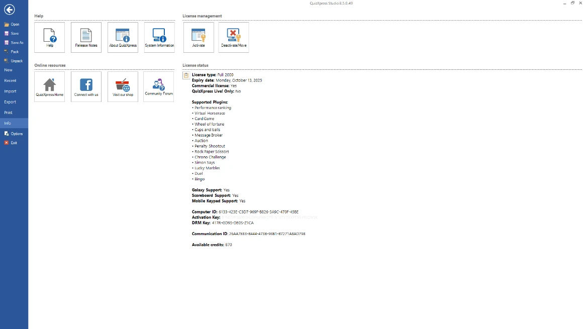

# Backstage Menu

When clicking the FILE tab, or hitting F1, the backstage menu appears. { width="501" loading=lazy }

Here you access global application functionality for which the details are available on several other tabs:

| **New**                              | Create a new quiz and select the aspect ratio of the slides            |
|--------------------------------------|------------------------------------------------------------------------|
| **Recent**                           | Open recent and example files                                          |
| **Import**                           | Import questions from Excel or from another quiz file                  |
| **Export questions to Excel or PDF** | Export question to Excel or PDF                                        |
| **Print**                            | Print your quiz slides                                                 |
| **Info**                             | Access the Help file, various online resources and manage your license |
