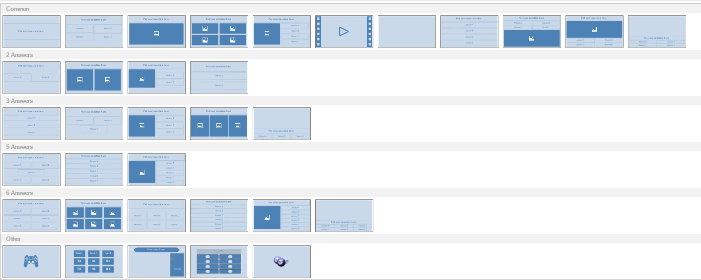

# Design area

The design area contains a visual representation of what we call a ‘quiz slide’. It shows the ‘quiz slide’ exactly as it will be shown during the game show. A ‘quiz slide’ consists of several items: a question, multiple choice answers, pictures, shapes and text, a video or a sound item etc. Items can be selected individually or as a group after which they can be modified. Also, the quiz slide as a whole can be selected to edit its properties. To select a quiz slide, click on the slide background. See [Quiz slide properties](advanced-properties-grid.md#quiz-slide-properties) for an overview of all properties of a slide.

Slide items can be selected and resized by left-clicking one of the resize handles and dragging it to the desired size. When multiple items are selected, either using the Ctrl key or by dragging a selection box with the mouse, editing properties shown in the property pane (or using ribbon controls) changes the properties for all selected items at once. This is handy, for example, when you want to set the font for all answers in a question at once: first select all the answers, then change the ‘font’ property in the properties pane. While moving objects around, they snap to an invisible grid; hold down the *Ctrl* key while dragging to turn off this snapping.

## Inserting a slide

To insert a new slide, go to the INSERT menu and choose one of the predefined layouts in the ‘Quiz Slides’ section. Dark blue boxes represent placeholders for inserting a picture or video.

{ loading=lazy }

By choosing the layouts on the bottom row, you can insert a minigame, a Trivia Board, a Trivia Ladder, a Trivia Feud game, or a Bingo round, respectively.

You can also change the layout of an existing slide from the DESIGN menu by clicking the dropdown arrow in the ‘Change Layout’ section. The same dropdown list shown above appears, letting you choose a new layout. Items from the current layout that fit into the new layout will be copied over. For example, when you go from a layout with a question, a picture, and three answers to a layout with a question, a picture, and four answers, the picture, question, and three answers will all be copied to the new layout.
