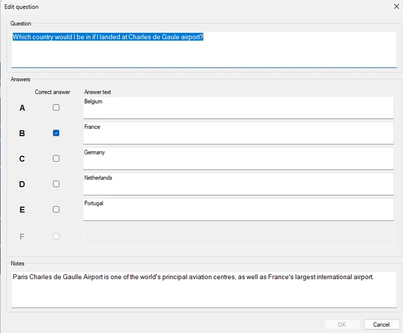
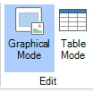
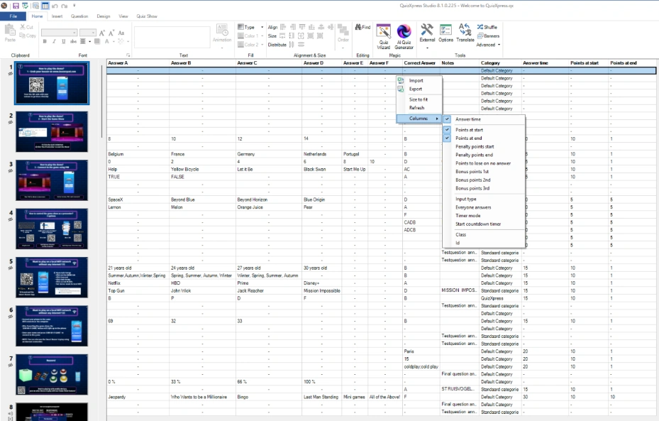
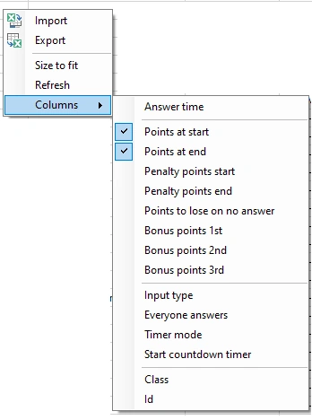

# Editing content

In order to edit content, click the elements on the slide and change the properties of the selected element in the ribbon or the properties pane.

To edit the question and all the answers, use the ‘Edit...’ entry in the slide’s context menu (right-click the slide and select ‘Edit...’). This brings up the ‘Edit question’ form. Alternatively, you can double-click the slide.

{ width="333" loading=lazy }

In this form you easily change the question and answers in one go.

Furthermore, Studio offers two views for editing content: Graphical Mode and Table Mode. You can select one of the modes on the VIEW ribbon.

{ width="85" loading=lazy }

## Graphical Mode

Graphical mode shows a graphical representation of the slide in the design area. It is a ‘what you see is what you get’ view: you see the slide exactly as it will appear in the quiz player. Note: press F5 or the Preview Slide button on the ribbon for a full-screen preview of the slide.

## Table Mode

In table mode you see an overview of all slides in a table. You see the slide type, the question, answers, correct answer and notes (if applicable, depending on the slide type) which can be conveniently edited in one view.

{ width="593" loading=lazy }

{ width="193" loading=lazy }

You can show and edit additional frequently used properties in columns by right clicking in the table.

Click on the Columns submenu and choose the properties you would like to appear in the table.

In addition to being able to edit the values in a table, it's also helpful to view all values at a glance for all questions, making it easier to double-check that everything is set as expected.

The ‘Size to fit’ option resizes the columns to a width where all the column content is readable.

### Import Export in table mode

You can import and export the content of the table to Excel.

An export will result in an Excel file with columns for the question, all answers, the correct answer and the slide notes.

| Q   | A1  | A2  | A3  | A4  | A5  | A6  | CORRECT | NOTES |     |
|-----|-----|-----|-----|-----|-----|-----|---------|-------|-----|

Other columns are currently not exported.

If you import a file with the above columns, the content of the table will be replaced one-to-one.

Import Export from table view enables you to easily replace *existing* content using data from Excel. All other design markup and the structure of the quiz will remain intact. Only the question, the answers, the correct answer and the notes are replaced.

QuizXpress also provides a more advanced Excel import and export functionality, allowing you to import an entire quiz from Excel, including various properties and the quiz design itself. For more details, see [Import of Excel format](../import-and-export-of-questions.md#import-of-excel-format)
