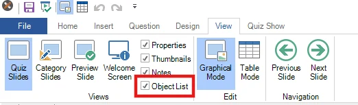
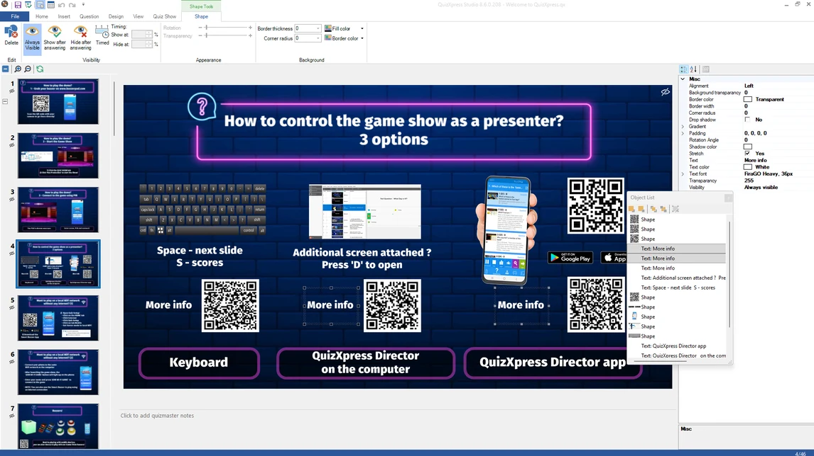

# Object List view

The Object List form can be toggled on/off in the View ribbon:

{ width="485" loading=lazy }

When this tool is enabled, a floating window appears that shows a list of all the objects on the current quiz slide. When you select an item in the list, the visual element on the slide is also selected (and vice versa). You can select multiple items, and you can drag and drop items in the list to rearrange their Z-order (visual front/back order). You can also double-click an entry in the list to invoke the default ‘Edit’ action for the item. For example, to edit the question text, just double-click the question item in the list.

{ loading=lazy }
