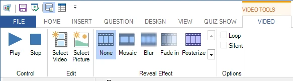

# Ribbon

The QuizXpress Studio user interface is built around the concept of a ribbon. The ribbon was introduced in Microsoft Office and greatly enhances user productivity and discoverability of features. Click [here](http://msdn.microsoft.com/en-us/library/windows/desktop/cc872782.aspx) for more general info on the Microsoft ribbon user interface concept.

The QuizXpress Studio ribbon is divided into several sections (Ribbon Tabs).

| **File**          | Also referred to as the ‘backstage’ menu. Access to global and file-related functionality.      |
|-------------------|-------------------------------------------------------------------------------------------------|
| **Home**          | General formatting and control elements                                                         |
| **Insert**        | Add new elements such as sound and text to your quiz slide                                      |
| **Question**      | Configure the behavior of a question (points, type of question, etc.)                           |
| **Design**        | Format your slide in different styles and layouts                                               |
| **View**          | Select what to view in the user interface of QuizXpress Studio                                  |
| **Quiz Show**     | Start the quiz show!                                                                            |
| **Picture**       | Configure pictures (shown when selecting a picture on a slide)                                  |
| **Shape**         | Configure picture and text shapes (shown when selecting an inserted picture or text on a slide) |
| **Speech**        | Configure speech (shown when selecting a speech element on a slide)                             |
| **Chart**         | Configure charts (shown when selecting a chart on a slide)                                      |
| **Audio**         | Configure an audio fragment (shown when selecting audio on a slide)                             |
| **Video**         | Set the various video properties (shown when selecting a video on a slide)                      |
| **Trivia Board**  | Configure a Trivia Board slide (contextual tab)                                                 |
| **Trivia Ladder** | Configure a Trivia Ladder slide (contextual tab)                                                |
| **Bingo**         | Configure the properties for a Bingo round                                                      |
| **Word Game**     | Configure the properties for a Word Game (contextual tab)                                       |
| **Trivia Feud**   | Configure a Trivia Feud slide (contextual tab)                                                  |

Next to the global ribbon tabs that are always visible, there are so-called ‘contextual tabs’. Their visibility depends on the selected item in the editor. For example, when selecting a video item on the slide, the contextual tab for VIDEO appears:

{ width="460" loading=lazy }

The tab will disappear as soon as something else is selected on the slide.
