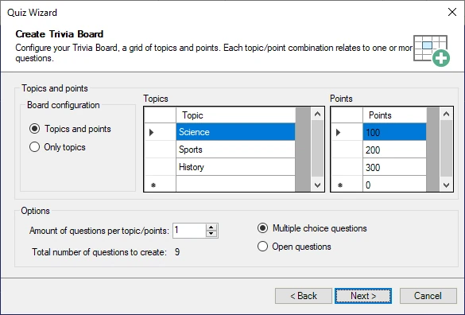

# The Quiz Wizard

To help you create new content fast, Studio also has a Quiz Wizard. To start it, on the HOME tab of the ribbon, click the ‘Quiz Wizard’ button in the ‘Magic’ section. The Quiz Wizard can help you create single slides or entire rounds. It guides you through a series of steps after which it will create the requested content. All you have to do afterwards is fill in the actual questions/answers on the created quiz slides. For example, to create a new Trivia Board, the Wizard shows the following configuration screen:

{ width="452" loading=lazy }

Here you specify how the Trivia Board grid will look and how many questions per points/category there will be.

Another example of using the wizard is the ability to generate an entire Disco Bingo round from a folder of mp3 files. It will read the artist/song mp3 tags (when present in the mp3 files) to automatically generate the correct answers to appear on the bingo cards.
