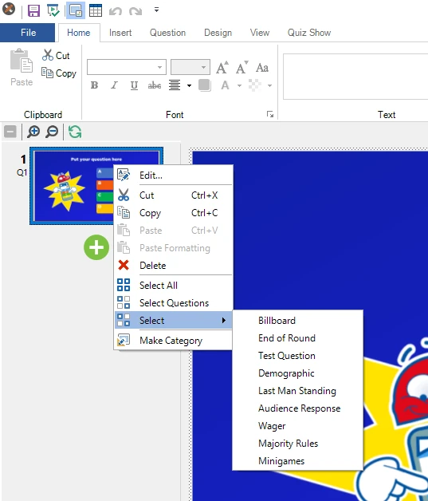
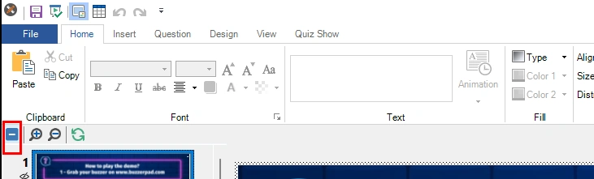
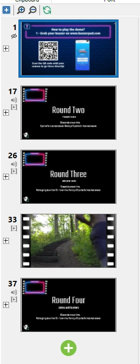
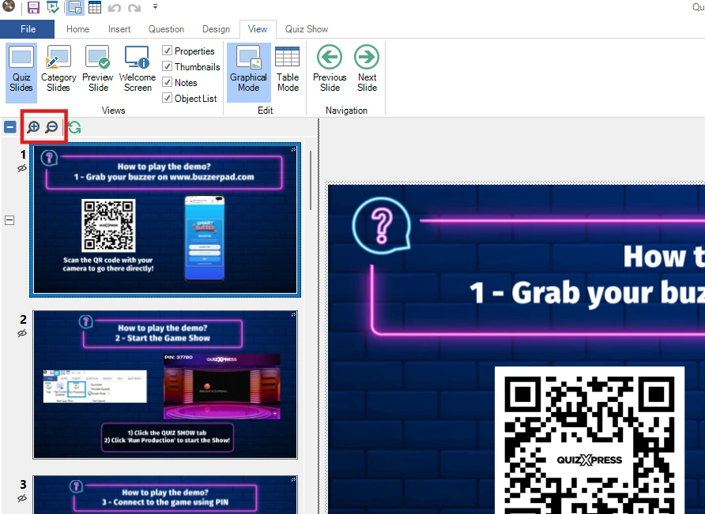

# Thumbnails panel

This panel gives you an instant overview of all your questions. You can navigate to a question by clicking a thumbnail, and move a question by dragging its thumbnail to a new position and dropping it there. The thumbnail panel lets you select multiple questions by clicking a thumbnail while holding down the *Ctrl* key, or by using the *Ctrl+A* shortcut to select all questions in the quiz. You can also select a range of questions by clicking the first thumbnail in the range, then the last thumbnail, while holding down the *Shift* key. When multiple questions are selected, you can change the properties of all questions at once using the property grid (if you don’t see the properties grid on the right-hand side of QuizXpress Studio, click VIEW in the ribbon and put a check before ‘Properties’). This also lets you delete multiple quiz slides at once.

The thumbnail panel has a context menu. Right click the thumbnail panel to open this menu:

{ width="228" loading=lazy }

From here you can copy/paste/delete one or more selected questions, select all slides, select all questions (banners are excluded from the selection when using ‘Select Questions’), or select all slides of a specific type. Note that you can also copy and paste quiz slides between two instances of Studio, allowing you to create ‘libraries’ of questions from which you build your specific quizzes.

In the Options dialog (which you can open from the HOME tab > Options button), you can enable the thumbnail panel to show extra information for each slide, such as the actual question number (as shown in QuizXpress Live). You can find this option on the ‘Other’ tab of the Options dialog:

**Collapse/expand rounds**

You can collapse or expand the list of thumbnails at the rounds level to quickly see the structure of the loaded quiz. This is useful when there are many slides and rounds in a quiz. At the top of the panel, there is a toolbar with a **\[-\]** **Collapse All** / **\[+\]** **Expand All** tool. Clicking **Collapse All** collapses the list to round level:

{ width="602" loading=lazy }

After that, you’ll see just the start of each round in the quiz (a round starts at the first slide after one or more end-of-round slides):

{ width="187" loading=lazy }

By clicking the \[+\] left of the round slide, the slides of that round will appear again. In the toolbar, you can click \[+\] to expand all rounds. When there are no rounds in your quiz, you will not see \[+\] or \[-\] next to the slides, and the toolbar control will be disabled.

**Zoom thumbnails**

If you like your thumbnails a little bit bigger, you can zoom in/out with the zoom tools:

{ width="591" loading=lazy }

*Note that when you zoom, the list of thumbnails is completely redrawn at the new size (zooming in requires more detail, which means a re-render), which may take a while depending on the size of the quiz.*
