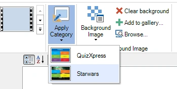

# Using categories

Categories allow you to make groups of questions look the same way. For example, within one quiz, you could have questions about science, music, movies, etc. To make all questions about science look the same, you can create a category called ‘Science’. For this category, you can then set properties such as the background image, the font, and the colors. When creating a new question about science, you can apply the ‘Science’ category, and the whole question will be formatted according to the ‘Science’ template. All categories are stored within your current quiz file. If you frequently use the same categories, we advise creating an empty quiz file to use as your starting point for all your quizzes. Categories also play an important role when importing questions directly from Excel: because advanced formatting information can’t be stored in Excel, each question in Excel can instead refer to an existing category from which the formatting will be applied to the newly created slide. To create a new category, first switch to ‘Category’ view:

{ width="407" loading=lazy }

Then activate the INSERT ribbon tab and click any of the templates and enter a name for your category:

{ width="220" loading=lazy }

Now you can set the properties of the category like the background to use. To apply a category, switch back to normal quiz slides view, select one or more slides in the thumbnail panel on the left, activate the DESIGN tab and pick the category from the Categories gallery:

{ width="350" loading=lazy }

Now the selected slide(s) will be formatted like the category slide.
